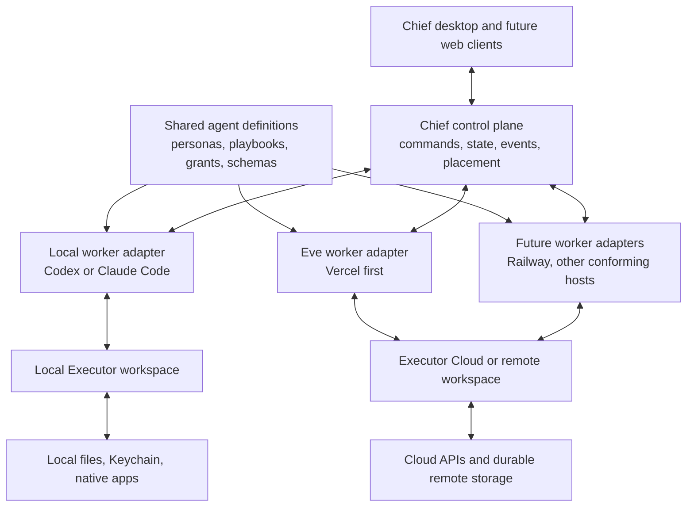

# Chief agent runtime platform

> Superseded for greenfield implementation by
> `chief-relay-platform-prd.md`. This document remains historical context for
> the earlier Vercel/Eve deployment plan.

Status: proposed implementation plan  
Date: 17 July 2026  
Audience: the agent or engineer implementing the next runtime architecture  
Related audit: `docs/agent-setup-and-run-flow.md`

## One-sentence brief

Make Chief one reliable agent product with two initial execution placements: local Codex or Claude workers for private, device-bound work, and durable Eve workspaces deployed to Vercel for always-on work, both governed by the same lifecycle, tool, approval, artifact, and user-interaction contracts.

## Executive decision

Chief should support multiple execution hosts, but it must not expose multiple orchestration models to the product.

The architecture should therefore have:

1. One Chief-owned control-plane contract for work definitions, occurrences, attempts, dependencies, inputs, approvals, artifacts, events, and placement.
2. One Chief agent definition format from which local and Eve representations are compiled.
3. One Executor boundary for integrations, credentials, authentication, and per-tool policy.
4. A local worker adapter that can run Codex and Claude Code, including their native subagent facilities.
5. An Eve worker adapter deployed to Vercel first, using Eve's durable sessions, root schedules, declared subagents, streaming protocol, and pause/resume behavior.
6. Future worker adapters for Railway and other suitable hosts without changing the desktop UI or core lifecycle.

Vercel is the first remote target. Railway is a later host target. Convex should remain the existing product/control-plane database during the first implementation rather than being confused with the worker runtime. A future Convex-native worker should only be attempted if its execution and durability primitives can satisfy the same conformance suite; it is not a reason to weaken the contract now.

The critical rule is:

> Placement chooses where work executes. It must not change what a run means, how it is resumed, how its state is displayed, or how its output is reviewed.

## Why this work exists

Chief already contains most of the required pieces, but they currently form two partially independent systems.

### Local today

- The Tauri app supervises a custom Node runtime.
- The local scheduler polls local SQLite records.
- A `SessionManager` opens Codex-backed sessions directly.
- Specialist recurring work starts the specialist directly.
- Transcripts, recurring work, attempts, attention items, drafts, prospects, and files live in the local runtime database.
- Local Executor workspaces expose integrations and Chief-local tools over MCP.
- Marker strings such as `CHIEF_SETUP_REQUIRED`, `CHIEF_INPUT_REQUEST`, and `CHIEF_RESUME_WORK_ID` carry control-plane meaning inside model output and prompt text.
- Work cannot execute while the device and local runtime are offline.

### Remote today

- `apps/workspace/scripts/generate.ts` compiles shared personas and workspace inputs into an Eve filesystem layout.
- The generated workspace contains a root agent, declared specialist subagents, skills, and root-level schedules.
- Eve provides durable sessions and a stable HTTP/streaming API.
- The generated workspace is not yet the runtime that the desktop application consistently controls.
- Local and remote flows do not yet produce one normalized state or event model.

### Resulting product failures

- The UI can say a run is still active after it has completed.
- A submitted input can save correctly but resume a different transcript while the old transcript remains visible.
- Setup blockers can be shown as runtime failures instead of actionable work.
- A connected integration can exist in one store without the first user-visible report existing in another.
- A local restart can reconcile or retry work in ways that are difficult to distinguish from duplicate scheduling.
- “Parent agent” has different meanings in local Codex execution and deployed Eve execution.
- A user cannot reason about which work continues with the app closed.

This PRD turns these failures into explicit platform contracts and an ordered migration.

## Product principles

### One product, not glued runtimes

The desktop app consumes Chief contracts, not Codex events, Claude events, or Eve events directly. Host-specific events are normalized at the adapter boundary.

### Durable state is explicit

No lifecycle transition may depend only on a prompt marker, in-memory map, mounted React component, or currently open transcript.

### Model output is work product, not control-plane state

Models may propose structured outcomes through typed tools or validated structured output. The runtime must not parse ordinary prose to decide whether an integration is connected, a dependency exists, a user response is required, or a run should be retried.

### One occurrence, many attempts

A schedule occurrence is the unit of intended work. It may have several attempts, but retries never create duplicate intended work and the Overview does not present attempts as separate jobs.

### Blocked is a valid durable outcome

Missing credentials, authorization, data, or approval are not runtime crashes. They create typed dependencies or input requests that can be completed and resumed.

### Executor is the integration boundary

Agents should not each own integrations or secrets. Executor owns the catalog, connections, authentication, and tool policy. Local and remote workers receive the same logical capability grant even if their Executor endpoint differs.

### Artifacts are first-class

Draft content, reports, prospects, charts, files, and campaign plans must be durable, addressable outputs. A transcript summary is not a substitute for a reviewable artifact.

### Placement is capability-aware

Device files and device-only credentials require a local placement. Reliable background work requires a remote placement. Chief must not silently move work between hosts unless both capability and authorization parity have been verified.

## Goals

### G1. Local execution

Allow a Chief workspace to use Codex or Claude Code locally, including provider-native delegation/subagents, while preserving a Chief-owned durable lifecycle and review history.

### G2. Always-on execution on Vercel

Allow approved work to run through an Eve workspace deployed to Vercel while the desktop app is closed, with progress, input requests, artifacts, and terminal state visible when the user returns.

### G3. Seamless placement

The same playbook and work definition should be placeable locally or remotely without UI-specific branches or rewritten prompts.

### G4. Reliable setup and recovery

An agent that lacks a prerequisite should create a typed dependency, request the minimum required user action, verify completion, and resume the blocked occurrence exactly once.

### G5. Host portability

Add Railway or another host by implementing the worker adapter and passing the conformance suite, not by creating a new product flow.

### G6. Operational trust

Prevent duplicate runs, runaway retries, stale status, secret leakage, and ambiguous completion. Make every attempt traceable by IDs across the desktop, control plane, worker, Eve, and Executor.

## Non-goals

- Replacing Executor with host-specific integration code.
- Making cloud work silently access local files or local Keychain secrets.
- Automatically publishing, messaging, spending, or mutating external systems without the user's declared grant.
- Running every scheduled job through a permanently alive CMO conversation.
- Treating every specialist task as a multi-agent workflow when a direct specialist run is sufficient.
- Building the Railway or Convex-native worker before the Vercel/Eve implementation passes production gates.
- Rebuilding the entire desktop UI before the shared lifecycle is functional.
- Migrating all existing local data before the new records and adapters are proven side by side.

## User-facing contract

The implementation is successful when the user can understand Chief this simply:

1. I choose what Chief should do and whether it can run only on this computer or continuously in the cloud.
2. Chief shows work as upcoming, running, waiting for me, completed, or failed.
3. If Chief needs a credential, authorization, answer, or approval, I complete it in one place and the same work continues.
4. When Chief says an integration is ready, a real provider read has succeeded and the first useful product data has been stored.
5. When Chief produces work, I can open and review the complete artifact.
6. Closing and reopening the app does not duplicate, lose, or falsely restart work.
7. Cloud work continues when my computer is off. Local work is clearly identified as device-dependent.
8. Run History preserves every attempt and transcript, while Overview shows only the current intended work and decisions that need me.

## Target architecture



### Control plane

The Chief control plane owns product truth:

- Workspace and agent configuration
- Work definitions and schedules
- Occurrence identity
- Placement and capability requirements
- Attempt state and normalized event cursor
- Dependencies, input requests, and approvals
- Action items and notifications
- Artifact metadata and storage references
- Deployment records and health
- Integration readiness as reflected in the product

Convex is the pragmatic first store for these records because it already owns Chief product data and realtime queries. Local-only data may be mirrored or cached in SQLite, but local SQLite must not become a second conflicting source of truth for remotely placed work.

### Worker adapters

A worker adapter executes one claimed occurrence and speaks the shared protocol. It does not define product semantics.

Required adapter operations:

```ts
interface WorkerAdapter {
  kind: "local-codex" | "local-claude" | "vercel-eve" | string;
  inspectCapabilities(input: CapabilityProbe): Promise<CapabilityReport>;
  startAttempt(input: StartAttemptCommand): Promise<AttemptHandle>;
  streamEvents(input: StreamAttemptCommand): AsyncIterable<RuntimeEvent>;
  submitInput(input: SubmitInputCommand): Promise<void>;
  submitApproval(input: SubmitApprovalCommand): Promise<void>;
  cancelAttempt(input: CancelAttemptCommand): Promise<void>;
  inspectAttempt(input: InspectAttemptCommand): Promise<AttemptSnapshot>;
}
```

The final names may differ, but the behaviors must be explicit and contract-tested.

### Agent definition compiler

Shared source definitions should describe:

- Agent ID, role, description, and instructions
- Model/provider preferences by placement
- Skills and playbooks
- Allowed specialist delegation
- Required and optional capabilities
- Default tool grants
- Artifact output schemas
- Success criteria
- Whether a work type runs direct or supervised

Those definitions compile into:

- Local Codex/Claude session configuration
- Eve root and declared-subagent directories
- Eve root schedules for cloud-placed recurring work
- UI roster metadata
- Deployment manifests and capability requirements

`packages/agent-runtime/src/agents` is the current shared roster and should be evolved rather than duplicated in the Eve app.

### Integration plane

Executor remains the sole agent-facing integration catalog.

Local:

- One isolated Executor workspace per Chief workspace.
- Credentials remain in local Keychain or Executor's supported local secret provider.
- Local workers connect through MCP.
- Device-specific tools may be present.

Remote:

- One isolated remote Executor scope/tenant per Chief workspace.
- OAuth and provider credentials are stored through Executor's remote credential model, not copied into generated prompt files.
- Eve connects to Executor over its remote MCP surface.
- Vercel environment variables contain only platform bootstrap credentials and signed control-plane access, never a growing set of customer provider secrets.

Tool grants are stored as exact logical Executor addresses plus policy version. Each attempt receives an immutable grant snapshot.

## Canonical domain model

The implementing agent should add a small shared package, preferably `packages/agent-contracts`, containing versioned Zod schemas and inferred TypeScript types. It must not import Tauri, Eve, Codex, Claude, Convex React hooks, or SQLite.

### WorkDefinition

Describes intended reusable work.

Minimum fields:

- `id`
- `workspaceId`
- `title`
- `agentId`
- `playbookId`
- `instructions`
- `schedule` or one-off trigger
- `timezone`
- `status`: `draft | active | paused | archived`
- `placementPolicy`
- `executionMode`: `direct | supervised`
- `capabilityRequirements`
- `toolGrant`
- `missedRunPolicy`
- `retryPolicy`
- `createdAt`, `updatedAt`, `version`

### Occurrence

Represents one intended execution of a work definition.

Minimum fields:

- `id`
- `workspaceId`
- `workDefinitionId`
- `scheduledFor`
- `occurrenceKey`
- `trigger`: `schedule | manual | webhook | agent | onboarding | dependency_resume`
- `state`
- `placement`
- `currentAttemptId`
- `dependencyIds`
- `inputRequestIds`
- `artifactIds`
- `createdAt`, `updatedAt`

`occurrenceKey` must be unique for a work definition and intended scheduled time. It is the durable idempotency key across every host.

Recommended occurrence states:

```text
pending
  -> claimed
  -> running
  -> waiting_for_input
  -> waiting_for_dependency
  -> waiting_for_approval
  -> succeeded
  -> failed
  -> cancelled
  -> skipped
```

Waiting states may return to `pending` or `running` only through an explicit command that records why.

### Attempt

Represents one host execution attempt for an occurrence.

Minimum fields:

- `id`
- `occurrenceId`
- `attemptNumber`
- `workerKind`
- `workerInstanceId`
- `providerSessionId`
- `eveSessionId` and continuation token reference when applicable
- `leaseOwner`, `leaseExpiresAt`
- `state`
- `startedAt`, `heartbeatAt`, `completedAt`
- `terminalCode`, `terminalSummary`
- `eventCursor`
- `grantSnapshot`
- `deploymentVersion`

Attempts are never overwritten. The Overview groups them under their occurrence; Run History exposes them individually.

### RuntimeEvent

Both local providers and Eve must normalize into a versioned event envelope:

```ts
type RuntimeEvent = {
  version: 1;
  eventId: string;
  workspaceId: string;
  occurrenceId: string;
  attemptId: string;
  sequence: number;
  timestamp: string;
  type: RuntimeEventType;
  data: unknown;
};
```

Required event types:

- `attempt.started`
- `attempt.heartbeat`
- `reasoning.status` for safe user-facing progress, not hidden chain-of-thought
- `message.appended`
- `message.completed`
- `tool.requested`
- `tool.completed`
- `tool.failed`
- `subagent.started`
- `subagent.completed`
- `input.requested`
- `input.answered`
- `authorization.requested`
- `authorization.completed`
- `dependency.requested`
- `dependency.resolved`
- `artifact.created`
- `artifact.updated`
- `attempt.completed`
- `attempt.failed`
- `attempt.cancelled`

Every adapter must preserve event order and deduplicate by `eventId`/`sequence` after reconnect.

### Dependency

A dependency replaces `CHIEF_SETUP_REQUIRED` and instruction-string links.

Minimum fields:

- `id`
- `occurrenceId`
- `kind`: `integration | secret | authorization | user_answer | approval | data_source | agent_task`
- `provider` or capability ID
- `state`: `open | in_progress | resolved | declined | expired`
- `requestedByAttemptId`
- `resolutionOccurrenceId`
- `inputRequestId`
- `verification`
- `createdAt`, `resolvedAt`

Resolving a dependency must atomically make the blocked occurrence eligible to continue. It must not create a retry loop.

### InputRequest

An input request is owned by the occurrence, not a React component or one transient transcript.

Minimum fields:

- `id`
- `occurrenceId`
- `attemptId`
- `title`, `description`
- validated field schema
- destination policy for each field
- `state`: `open | answered | cancelled | expired`
- `responseReceipt` containing key names or secure references, never secret values
- `createdAt`, `answeredAt`

Submitting input should navigate or subscribe the UI to the active continuation automatically. The form must not disappear into an old historical transcript.

### ApprovalRequest

Approvals are separate from missing input and have an immutable proposed action/grant snapshot. Scheduled work does not repeatedly ask for approval already covered by its grant.

### Artifact

Minimum fields:

- `id`
- `workspaceId`
- `occurrenceId`
- `attemptId`
- `type`: `document | content_draft | report | chart | prospect | campaign | file | other`
- `title`
- `mimeType`
- `storageRef`
- `previewRef`
- `status`: `draft | in_review | approved | scheduled | published | archived`
- `metadata`
- `createdAt`, `updatedAt`

The transcript may link to artifacts, but artifact bodies must not exist only as prose inside the transcript.

### Placement

Use an extensible record, not a boolean:

```ts
type Placement =
  | { mode: "local"; worker: "codex" | "claude"; deviceId: string }
  | { mode: "remote"; host: "vercel"; runtime: "eve"; deploymentId: string }
  | { mode: "remote"; host: string; runtime: string; deploymentId: string };
```

The user-facing choices may be simpler, such as “On this Mac” and “Always on.” The stored contract should remain host-extensible.

## Execution semantics

### Claiming and leases

Before starting an attempt, a worker must atomically claim an occurrence through the control plane.

Rules:

- Only one active attempt may exist per occurrence.
- Only one active occurrence may exist for a work definition when its concurrency policy is `forbid`.
- Claims have a lease and heartbeat.
- An expired lease is reconciled before another attempt starts.
- A replacement attempt records the prior attempt as abandoned or failed with a machine code; it never erases it.
- The partial unique index already added locally for one active recurring run is a useful defense, but the canonical remote claim must live at the occurrence/control-plane layer.

### Retries

Default policy:

- Retry at most once for a classified transient transport/provider/runtime failure.
- Use exponential backoff plus jitter.
- Never retry `waiting_for_input`, `waiting_for_dependency`, declined approval, policy denial, invalid configuration, or a deterministic validation error.
- Never retry immediately in a tight loop.
- A user-triggered “Try again” creates a new attempt under the same occurrence.
- A later schedule time creates a new occurrence.

Every terminal code must be typed, for example:

- `TRANSIENT_PROVIDER_ERROR`
- `WORKER_UNAVAILABLE`
- `POLICY_DENIED`
- `INPUT_REQUIRED`
- `DEPENDENCY_REQUIRED`
- `INVALID_OUTPUT`
- `NO_EVIDENCE`
- `CANCELLED_BY_USER`
- `LEASE_EXPIRED`

### Missed schedules

The default for recurring marketing work should be `coalesce_latest`:

- If a local device was offline for several schedule times, create or retain one catch-up occurrence for the latest missed time.
- Do not replay every missed period.
- Tell the user the work was delayed because the device was offline, without presenting it as an error.
- Once cloud placement is active, schedules execute remotely and do not depend on the desktop.

Other policies may be added later: `skip`, `replay_all`, and `replay_bounded`. They must be explicit per work definition.

### Direct versus supervised work

Not every run needs a permanent parent agent.

`direct` mode:

- A named specialist executes the occurrence.
- The Chief control plane owns dependencies and recovery.
- The UI must not claim a CMO is continuously watching.
- Appropriate for a deterministic recurring playbook such as a weekly growth report.

`supervised` mode:

- The root CMO owns the session and may delegate to declared specialists/native subagents.
- Appropriate for open-ended goals, multi-step planning, or work needing synthesis across specialists.
- Local Codex and Claude use their native subagent facilities behind the adapter.
- Eve uses declared subagents or the built-in agent tool as documented.

This distinction preserves resourcefulness without paying for or pretending there is a permanent parent process for every schedule.

### Setup and dependencies

When a worker discovers a missing prerequisite it must call a typed Chief control-plane tool, not print a marker line.

Example logical tools:

- `chief.dependencies.request`
- `chief.inputs.request`
- `chief.approvals.request`
- `chief.integrations.inspect`
- `chief.integrations.beginSetup`
- `chief.integrations.verify`
- `chief.artifacts.save`

The control plane creates the dependency and, when appropriate, a Setup occurrence. The original occurrence moves to a waiting state. A verified setup result resolves the dependency and resumes the original occurrence once.

The Setup agent is a specialist, not the source of truth. Product code independently verifies provider access and writes the integration state.

### Integration readiness

Use one state machine per workspace/provider:

```text
selected
  -> preparing
  -> waiting_for_input
  -> waiting_for_authorization
  -> verifying
  -> connected
  -> initial_sync
  -> ready
```

Failure and revocation states:

```text
blocked | error | disconnected | revoked
```

Definitions:

- `connected`: authentication and a real provider read succeeded.
- `ready`: the provider read succeeded and Chief stored the first product artifact/snapshot required by the relevant UI.

For Google Analytics, client ID and secret alone are not `connected`. OAuth consent, refresh credentials, property verification, a real report, and first snapshot persistence are required before `ready`.

## Local runtime requirements

### Process ownership

The Tauri shell owns one local worker supervisor per installed app instance.

Required behavior:

- Single-instance lock for the sidecar/scheduler.
- Explicit startup phases: `starting`, `connecting`, `ready`, `degraded`, `disconnected`.
- Blue pulsing “connecting” UI while startup or recovery is in progress.
- Health endpoint includes database, worker provider, Executor, event stream, and scheduler readiness.
- Exponential reconnect with jitter.
- Runtime restart does not require sign-out or manual repair.
- Port conflicts are reconciled rather than leaving a second partial scheduler alive.
- Desktop subscriptions resume from an event cursor and immediately reconcile a snapshot.

### Codex adapter

The Codex adapter should:

- Preflight the bundled or configured Codex executable and runtime dependencies.
- Create a provider session for an attempt.
- Map Codex lifecycle events to `RuntimeEvent`.
- Support follow-up input when the same session is resumable.
- Persist the provider session ID needed to reconnect where supported.
- Normalize native subagent activity into subagent events.
- Treat process exit, missing binary, and protocol failure as typed terminal codes.
- Never expose provider-specific errors as generic setup blockers.

### Claude adapter

The Claude adapter should satisfy the same contract.

It must not assume a shell's interactive PATH. The packaged runtime needs an explicit Node and Claude Code resolution strategy so installed builds do not fail with `spawn node ENOENT`.

### Local state

SQLite remains useful for:

- Device-resident transcripts and artifacts
- Offline command outbox
- Cached control-plane projections
- Local provider session metadata
- Device capability inventory

It should not independently schedule cloud-placed work or invent product state that the control plane cannot reconcile.

## Eve on Vercel requirements

### Deployment unit

The first implementation should deploy one workspace agent application containing:

- One root CMO agent
- Declared specialist subagents
- Shared playbook skills
- Chief control-plane tools/hooks
- Executor connection
- Root-only cloud schedules

Do not deploy a separate Vercel project for every specialist unless real scale/cost evidence later requires it. Eve schedules are root-only and declared subagents are naturally isolated within the workspace app.

### Generated workspace

Evolve `apps/workspace/scripts/generate.ts` into a deterministic compiler that emits a deployment manifest in addition to the Eve filesystem.

The manifest should contain:

- Workspace ID
- Definition version/hash
- Agent roster version
- Playbook versions
- Schedule versions
- Required capabilities
- Executor scope reference
- Control-plane endpoint audience
- Deployment schema version

Generated output must contain no customer secret values.

### Durable sessions

Use Eve's stable HTTP API and durable Workflow SDK semantics rather than wrapping Eve in a second custom session manager.

The adapter maps:

- Eve session ID to Chief attempt
- Eve continuation token to a secure attempt reference
- Eve stream events to `RuntimeEvent`
- Eve input/authorization events to Chief input and approval records
- Eve terminal events to attempt state

On process or deployment restart, the same durable Eve session should resume from its Workflow checkpoint where Eve supports it.

### Scheduling

Cloud-placed schedules are authored only at the Eve root.

Each schedule invocation must include the Chief occurrence idempotency key and claim the occurrence before model execution. Eve's schedule firing does not by itself prove that Chief has not already run the occurrence.

### Deployment lifecycle

Recommended states:

```text
draft -> building -> deploying -> verifying -> healthy -> draining -> retired
```

Requirements:

- Deployments are versioned and immutable.
- Re-running deployment with the same manifest hash is idempotent.
- A deployment is not selectable until a smoke session, Executor catalog read, control-plane callback, and schedule registration check pass.
- Updating a deployment drains active sessions or pins them to the old version until completion.
- Rollback selects the last healthy manifest without mutating its contents.
- The desktop shows deployment health without requiring the deployed worker to be currently running a task.

### Authentication

- Desktop-to-control-plane uses existing authenticated organization context.
- Worker-to-control-plane uses short-lived, audience-bound service credentials scoped to one workspace/deployment.
- Control-plane commands to workers are signed and replay-protected.
- Eve/Executor credentials never travel through model messages.
- Event ingestion validates workspace, deployment, attempt, sequence, and signature.

## Placement policy

### User-facing policy

Initial choices:

- `On this Mac`: private/device-bound; runs when Chief and the local runtime are available.
- `Always on`: deployed through Eve on Vercel; runs without the desktop.

### Automatic recommendation

Chief may recommend a placement but should not silently change it.

Recommend local when work requires:

- Local filesystem access
- Native desktop applications
- Local-only Executor connections
- Local Keychain credentials that have not been connected remotely

Recommend remote when work requires:

- Reliable schedules while the computer is off
- Cloud API integrations already connected to remote Executor
- Webhooks or external event triggers
- Long-running durable pause/resume

### Switching placement

Switching is a migration, not a toggle on an active attempt.

1. Pause future occurrence creation.
2. Allow the current attempt to finish or cancel it explicitly.
3. Verify capabilities and grants on the destination.
4. Update the work definition version and placement.
5. Register the next occurrence on the destination.
6. Confirm no duplicate schedule remains active on the old host.

No automatic failover should occur unless the destination has verified capability parity and can acquire the same occurrence lease.

## Desktop UX requirements

### Overview

- Action cards represent occurrences needing user judgment, input, authorization, or approval.
- Setup-required is an actionable card, not a failed runtime toast.
- Running and upcoming work appears in a bounded, internally scrollable timeline.
- Repeated attempts are grouped under one occurrence.
- The page itself should not need to grow because Run History contains many attempts.
- Realtime state comes from the canonical occurrence projection, not locally inferred timestamps.

### Run detail

- One route follows the occurrence and shows the active attempt automatically.
- Attempt history is accessible without losing the current context.
- Input submission updates the occurrence and follows the resumed/new attempt.
- Completed and failed transcripts remain readable.
- Tool activity may be shown as concise safe progress; hidden chain-of-thought is not shown.
- Artifacts are directly openable from the run.

### Run History

- Shows successful, waiting, failed, cancelled, and abandoned attempts with filters.
- Never discards a transcript because an attempt failed.
- Groups by occurrence by default; allows expanding attempts.
- Does not auto-filter failures out of existence.

### Notifications

- A waiting dependency or input request is communicated as “Chief needs your help,” not “runtime error.”
- Local catch-up after the app was closed is informational, not an error.
- Transient failures are shown only after retry policy is exhausted.
- Toasts auto-dismiss after the product's standard interval, but durable action items remain until resolved/dismissed.

## Data ownership

| Data | Canonical owner | Local projection/cache |
| --- | --- | --- |
| Workspace/product metadata | Convex control plane | Desktop query cache |
| Work definitions and placement | Convex control plane | SQLite projection |
| Occurrences, dependencies, action items | Convex control plane | SQLite projection/outbox |
| Remote attempts and deployment health | Control plane + Eve session refs | SQLite projection |
| Local provider transcripts | Local SQLite, synchronized metadata | Native |
| Remote transcripts | Eve durable session/event store, indexed by control plane | Optional desktop cache |
| Artifact metadata | Control plane | SQLite projection |
| Local artifact body | Workspace filesystem/local object store | Native |
| Remote artifact body | Remote object storage | Optional downloaded cache |
| Integration catalog/policy | Executor | Capability projection in control plane |
| Secret values | Executor/Keychain/provider auth store | Never in product DB |

Where legal/privacy requirements demand local-only content, the control plane stores only the minimum metadata needed to coordinate it.

## Repository shape

This is a target, not a mandatory one-shot move:

```text
packages/
  agent-contracts/       # versioned Zod schemas and protocol types
  agent-definitions/     # personas, playbooks, capability requirements
  agent-core/            # host-neutral lifecycle and policy functions
  agent-runtime/         # current local runtime, progressively reduced
  worker-local/          # Codex/Claude adapter and Tauri-side supervisor API
  worker-eve/            # Eve adapter, hooks and deployment compiler helpers
  executor-bridge/       # Chief capability/grant mapping, no credentials

apps/
  desktop/               # consumes control-plane/client contracts
  workspace/             # generated Eve application for Vercel

packages/backend/convex/
  agentWork*.ts          # work, occurrence, attempt and action APIs
  deployments*.ts        # deployment manifests and health
  runtimeEvents*.ts      # idempotent normalized event ingestion/projections
```

Do not perform this directory move before the contracts exist. First introduce boundaries, then move code while tests stay green.

## Ordered implementation plan

Each phase has an exit gate. Do not start the next risky migration until the gate passes.

### Phase 0: preserve and instrument the current system

Purpose: stop further ambiguity while the new path is built.

Work:

1. Keep the local single-active-run database invariant and migration.
2. Add correlation logging for workspace, work definition, occurrence-equivalent scheduled time, run/attempt, chat, provider session, and Executor execution.
3. Document every current marker-string producer and consumer.
4. Add fixtures for representative Codex events, local run records, and Eve stream events.
5. Add a runtime health snapshot visible to diagnostics.
6. Add regression tests for the known duplicate Growth Report failure.

Exit gate:

- Two local runtime processes cannot execute the same due work concurrently.
- A failed/restarted local run can be traced end to end by IDs.
- No existing behavior regresses while contracts are introduced.

### Phase 1: create the shared contracts and state machine

Purpose: define product truth before adding another host.

Work:

1. Create `@chief/agent-contracts` with schemas for definitions, occurrences, attempts, events, dependencies, inputs, approvals, artifacts, placements, deployments, and error codes.
2. Add pure transition functions in `@chief/agent-core`.
3. Add Convex tables/functions for canonical work definitions, occurrences, dependencies, action items, placement, and deployment records.
4. Implement atomic occurrence creation/claim and event ingestion.
5. Add adapter conformance tests independent of any host.
6. Add a projection consumed by Overview and Run History.

Exit gate:

- Invalid transitions are rejected in tests.
- Duplicate occurrence keys and duplicate event sequences are idempotent.
- The UI can render fixture projections without knowing their host.

### Phase 2: adapt the current local runtime to the contract

Purpose: prove the contract against the existing product before remote rollout.

Work:

1. Wrap Codex as `local-codex` and Claude as `local-claude` adapters.
2. Normalize provider events.
3. Replace scheduler-owned attention inference with typed dependencies and input requests.
4. Publish local occurrence/attempt events through the control-plane API with a durable offline outbox.
5. Make local SQLite a local-body/cache store for canonical records.
6. Update the desktop to consume occurrence projections.
7. Keep compatibility reads for legacy recurring work during migration.

Exit gate:

- Current local work runs through the shared occurrence/attempt lifecycle.
- App/runtime restart does not duplicate an occurrence.
- A submitted input follows and resumes the correct active occurrence.
- Both Codex and Claude adapters pass the same lifecycle fixtures, or Claude remains feature-flagged until it does.

### Phase 3: make integration setup a typed workflow

Purpose: eliminate the largest source of dead-end runs before always-on deployment.

Work:

1. Implement the provider integration state machine.
2. Expose typed Chief setup/dependency tools through Executor's Chief-local/control-plane integration.
3. Replace `CHIEF_SETUP_REQUIRED`, `CHIEF_INPUT_REQUEST`, and `CHIEF_RESUME_WORK_ID` in the new path.
4. Make verification product-owned and provider-specific.
5. Persist the first required snapshot/artifact before marking a provider `ready`.
6. Make action cards render directly from dependencies/input requests.
7. Ensure a dependency resolution resumes the blocked occurrence once.

Exit gate:

- Google Analytics can move from selected to ready, including a real report and stored first snapshot.
- Credentials alone do not falsely mark it connected.
- A missing integration creates an actionable waiting state, not a failed/retrying run.
- No setup marker parsing is needed in the new path.

### Phase 4: build the Eve/Vercel worker adapter

Purpose: ship the first always-on execution path.

Work:

1. Add Chief control-plane tools/hooks to the generated Eve app.
2. Produce deterministic workspace manifests and hashes.
3. Implement Vercel deployment creation/update/verification.
4. Map Eve session and stream events to Chief contracts.
5. Store continuation references securely.
6. Configure remote Executor scope and verify its catalog/grants.
7. Make root schedules claim Chief occurrences before work begins.
8. Add smoke, reconnect, pause/input/resume, artifact, and schedule tests against a preview deployment.

Exit gate:

- A cloud-placed internal test schedule runs while the desktop is closed.
- Returning to the desktop shows live/completed state and artifacts without a manual refresh.
- User input can pause and resume the same durable Eve workflow.
- Re-deploying or double-firing a schedule cannot duplicate an occurrence.
- No customer secret is present in generated source or Vercel deployment metadata.

### Phase 5: placement UI and controlled rollout

Purpose: expose the capability safely.

Work:

1. Add “On this Mac” and “Always on” selection with capability explanations.
2. Add deployment health and setup flow.
3. Add placement migration command and schedule draining.
4. Feature-flag by workspace.
5. Run internal workspaces on Vercel first.
6. Add metrics and support diagnostics.
7. Migrate only eligible schedules; keep device-bound work local.

Exit gate:

- Placement changes never leave both schedules active.
- UI behavior is identical for local and remote fixture runs.
- Support can diagnose a failed remote run from correlation IDs and events.
- A 7-day internal soak has no duplicate occurrence, lost input, runaway retry, or stale status incident.

### Phase 6: remove legacy orchestration paths

Purpose: finish the migration rather than permanently operating two models.

Work:

1. Stop creating legacy local recurring-work records for migrated workspaces.
2. Remove marker-string control flow.
3. Split the current scheduler/server god objects into claim, execution, dependency, event, and projection services.
4. Remove UI branches that read host-specific state.
5. Migrate or archive legacy attempts with explicit provenance.
6. Update the implementation audit to describe the new truth.

Exit gate:

- One lifecycle drives every supported placement.
- No production UI component parses model text for control flow.
- Legacy scheduler code cannot dispatch migrated work.

### Phase 7: additional hosts

Purpose: prove portability after Vercel is stable.

Order:

1. Railway Eve host if Eve's build/start/durability dependencies are supported cleanly.
2. Self-hosted worker packaging if demanded by customers.
3. Convex-native execution only after a technical spike proves the same durable session, streaming, pause/resume, scheduling, and lease semantics.

Every host must pass the same adapter conformance and chaos suites. Do not fork the desktop experience.

## Ticket breakdown for the next agent

The implementing agent should work in this order and keep commits focused.

### Epic A: contracts

- A1. Add package scaffold and shared schema versioning.
- A2. Define occurrence and attempt state machines with tests.
- A3. Define normalized event envelope and fixtures.
- A4. Define dependency, input, approval, artifact, placement, and deployment schemas.
- A5. Add adapter conformance harness.

### Epic B: control-plane persistence

- B1. Add Convex schemas and indexes, including occurrence idempotency.
- B2. Add authenticated commands for create, claim, heartbeat, wait, resume, complete, fail, and cancel.
- B3. Add idempotent event ingestion and projections.
- B4. Add realtime queries for Overview, timeline, Run History, and run detail.
- B5. Add offline-safe local command outbox.

### Epic C: local adapter

- C1. Map current Codex events and process failures.
- C2. Add Claude Code executable/runtime preflight and mapping.
- C3. Rework local scheduler to claim occurrences rather than own product state.
- C4. Persist/reconcile provider session references.
- C5. Add single-supervisor health and reconnect tests.

### Epic D: typed setup

- D1. Add integration state model and provider verification interface.
- D2. Add typed control-plane tools exposed through Executor.
- D3. Replace setup marker output in new runs.
- D4. Implement Google Analytics end-to-end readiness.
- D5. Update Overview and run detail for waiting states.

### Epic E: Eve/Vercel

- E1. Refactor workspace generator into deterministic compiler + manifest.
- E2. Add Eve hooks/tools that speak Chief contracts.
- E3. Implement deployment service and health verification.
- E4. Implement Eve adapter event/input/approval mapping.
- E5. Implement root schedule occurrence claims.
- E6. Add preview deployment E2E and chaos tests.

### Epic F: product rollout

- F1. Add placement selection and capability inventory.
- F2. Add safe placement migration/draining.
- F3. Feature flag and internal soak.
- F4. Remove legacy lifecycle and marker parsing.
- F5. Update docs and operational runbooks.

## Test strategy

### Contract tests

Run the same suite against every worker adapter:

- Start and stream a normal attempt.
- Reconnect after stream interruption without duplicate events.
- Request and submit input.
- Request and complete approval.
- Create and resolve a dependency.
- Save and open an artifact.
- Cancel an attempt.
- Classify provider/runtime failure.
- Recover an expired lease.
- Reject a duplicate occurrence claim.

### Local E2E

- Fresh install with no shell PATH assumptions.
- Codex available, Claude unavailable.
- Claude available, Codex unavailable.
- Executor starts slowly or restarts.
- Desktop closes mid-run and reopens.
- Device sleeps across several schedule times.
- Two app/runtime processes see the same database.
- Input is submitted from historical run detail.

### Vercel/Eve E2E

- Deploy a workspace preview.
- Start a session and stream events.
- Pause for input, redeploy/restart, then resume.
- Fire the same schedule twice.
- Executor authorization pauses and resumes.
- Control plane temporarily rejects event ingestion, then receives replayed events.
- Desktop remains closed until after completion.
- Roll back while an older session is active.

### Product E2E

- Complete onboarding and see action items before Overview first renders.
- Selected recurring work appears once in Schedule.
- A missing integration produces one actionable dependency.
- Completing setup resumes the blocked occurrence once.
- Draft content is substantive, saved, directly reviewable, and present on the schedule when scheduled.
- Analytics reaches `ready` only after a real report and snapshot.
- Overview, timeline, Run History, and notifications agree on status.

### Chaos and soak

- Randomly terminate workers during each lifecycle state.
- Introduce delayed/duplicated/out-of-order event delivery.
- Expire leases and continuation credentials.
- Rotate deployment versions.
- Revoke an integration.
- Keep an internal workspace scheduled for at least seven days and assert no duplicate intended work.

## Observability and operations

Every log, event, error, and support diagnostic should carry:

- `workspaceId`
- `workDefinitionId`
- `occurrenceId`
- `attemptId`
- `workerKind`
- `workerInstanceId`
- `deploymentId`/version when remote
- `providerSessionId` or Eve session ID when safe
- `executorExecutionId` when applicable
- event sequence/cursor

Metrics:

- Occurrences created, claimed, succeeded, failed, waiting, cancelled
- Duplicate claims rejected
- Attempts per occurrence
- Retry reasons
- Time to first event
- Time in waiting states
- Input/approval completion rate
- Artifact production rate
- Local runtime connection uptime
- Remote deployment health
- Schedule lateness
- Setup-to-ready conversion by provider

Alerts:

- More than one active attempt per occurrence
- Repeated attempts beyond policy
- Event sequence gap that cannot be replayed
- Deployment unable to claim occurrences
- Executor catalog/connection unavailable
- Schedule lateness beyond threshold
- Runtime stuck in connecting/degraded state

## Security and privacy requirements

- Never store customer secret values in Convex records, generated Eve files, logs, artifacts, or model prompts.
- Store only secret references/key names and verification receipts.
- Scope remote worker credentials to one workspace and audience.
- Snapshot tool grants on every attempt.
- Separate read-only evidence tools from external mutations.
- Preserve explicit approval for publishing, messaging, spend, destructive writes, and grant expansion.
- Do not automatically copy local files or credentials into the cloud when placement changes.
- Record which host and model provider processed each attempt for audit/export.
- Apply retention and deletion to transcripts/artifacts across both local and remote stores.

## Performance and cost constraints

- Avoid a root-supervisor model call for deterministic direct work unless the work definition requests supervised mode.
- Batch or coalesce missed local schedule occurrences by default.
- Use event cursors/deltas rather than replaying full transcripts on every reconnect.
- Keep Overview queries projection-based and bounded.
- Limit subagent fan-out and require a finite declared task set.
- Enforce per-workspace concurrency and token/cost budgets.
- Remote deployment should scale to zero when idle without losing durable scheduled/session state.

## Release gates

### Gate 1: contract correctness

- State-machine and idempotency tests pass.
- No host-specific types leak into the desktop projection.

### Gate 2: local parity

- Existing internal local flows pass under the contract.
- No duplicate recurring attempt during restart/second-process tests.

### Gate 3: setup reliability

- Google Analytics reaches ready and populates Overview without mounting a special page.
- Input and authorization resume the correct occurrence.

### Gate 4: Vercel preview

- Remote schedule completes while desktop is closed.
- Event stream and artifacts reconcile on return.
- Duplicate firing and redeploy tests pass.

### Gate 5: production canary

- Feature-flagged internal workspaces complete a seven-day soak.
- No P0 runtime, duplicate, secret, or lost-input incident.

### Gate 6: public availability

- Operational dashboards and rollback exist.
- Support runbook can diagnose a run from one occurrence ID.
- Local/cloud placement limitations are accurately communicated.

## Key risks and mitigations

### Risk: the contract becomes another wrapper around two incompatible systems

Mitigation: adapter conformance tests must drive behavior. The desktop reads only normalized projections. Legacy marker paths are removed after migration.

### Risk: Convex, Eve, and local SQLite all claim ownership

Mitigation: publish the data-ownership table in code documentation and enforce writes through explicit services. Remote lifecycle truth is canonical in the control plane; local bodies/caches remain local where appropriate.

### Risk: remote Executor and local Executor capabilities drift

Mitigation: capability inventory and grant verification are required before placement or migration. No silent failover.

### Risk: per-workspace Vercel deployments are operationally expensive

Mitigation: start with a workspace deployment unit because it gives the cleanest isolation and Eve mapping. Measure build time, cold start, active project count, and cost before considering a multi-tenant worker pool.

### Risk: subagent autonomy increases cost and unpredictability

Mitigation: distinguish direct and supervised execution, bound fan-out, use typed outputs, and keep scheduler/dependency recovery deterministic.

### Risk: local providers cannot truly resume sessions after process death

Mitigation: model the attempt as failed/abandoned and create a new attempt under the same occurrence with full durable context. Do not pretend a new provider session is the same transcript.

### Risk: Eve or Vercel changes underneath the product

Mitigation: pin versions, keep Eve-specific code in one adapter, compile deterministic manifests, and run preview conformance before production upgrades.

## Decisions that should not be reopened during implementation

1. Executor remains the integration boundary.
2. Vercel/Eve is the first always-on worker.
3. Placement must not alter the product lifecycle.
4. Occurrence and attempt are distinct records.
5. Setup/input/dependency/approval state is typed and durable.
6. Marker strings are transitional compatibility only.
7. Remote execution must work while the desktop is closed.
8. A connection is not ready until a verified provider read and first required artifact/snapshot exist.
9. Run History preserves attempts; Overview groups them into intended work.
10. Future hosts pass the same conformance suite.

## Open decisions for the implementing agent to bring back with evidence

These decisions may require a short spike; do not guess silently.

1. Whether the first Vercel deployment is one project per workspace or a bounded multi-tenant deployment. Default to per-workspace for the first canary unless project limits make it impossible.
2. The exact remote artifact store compatible with Vercel, deletion, and signed previews.
3. Whether Eve exposes every continuation/event primitive needed without a custom hook; document any adapter gap before adding custom machinery.
4. The minimum local transcript/body data mirrored to Convex for cross-device visibility while respecting local-only privacy.
5. Whether Claude Code provides a durable resumable session identifier in the packaged runtime. If not, use new attempts honestly.
6. Which Convex mutations/actions should be called directly by trusted workers versus through a dedicated control-plane HTTP service.
7. Whether Railway can host the same compiled Eve output and Workflow durability without semantic changes.

## Definition of done

This initiative is done when:

- A work definition can be placed on local Codex, local Claude, or Vercel/Eve without changing its product representation.
- The same occurrence lifecycle, action cards, Run History, artifacts, input requests, approvals, and notifications work across those placements.
- Vercel/Eve work runs while the desktop is closed.
- Local work clearly communicates its device dependency and catches up according to policy.
- Duplicate dispatch, restart, reconnect, and retry cannot produce duplicate intended work.
- Missing setup produces an actionable dependency and resumes once resolved.
- Executor supplies the same governed logical tool surface locally and remotely.
- The implementation has passed contract, E2E, chaos, and seven-day canary gates.
- Legacy marker-driven orchestration is removed from production paths.
- The architecture can add another host through an adapter and conformance suite rather than another UI/runtime model.

## Ground-truth source map

Read these before changing the implementation:

- Current implementation audit: `docs/agent-setup-and-run-flow.md`
- Local scheduler and recovery: `packages/agent-runtime/src/scheduler.ts`
- Local session/runtime manager: `packages/agent-runtime/src/manager.ts`
- Local persistence: `packages/agent-runtime/src/local-store.ts`, `packages/agent-runtime/src/db/schema.ts`
- Runtime WebSocket/control surface: `packages/agent-runtime/src/server.ts`
- Executor workspace/control plane: `packages/agent-runtime/src/tools/control-plane.ts`, `packages/agent-runtime/src/tools/spec.ts`
- Shared persona definitions: `packages/agent-runtime/src/agents`
- Eve workspace compiler: `apps/workspace/scripts/generate.ts`
- Eve application: `apps/workspace/agent`
- Onboarding work creation: `apps/desktop/src/lib/onboarding-work.ts`, `apps/desktop/src/lib/onboarding-schedules.ts`
- Desktop runtime connection: `apps/desktop/src/lib/runtime.tsx`
- Overview projections/UI: `apps/desktop/src/pages/dashboard.tsx`
- Run detail/transcript UI: `apps/desktop/src/pages/results.tsx`, `apps/desktop/src/components/chat/agent-chat.tsx`
- Installed Eve documentation: `node_modules/eve/docs` through the resolved pnpm package
- Installed Executor overview: `node_modules/executor/README.md` through the resolved pnpm package

## First task for the next agent

Do not begin by refactoring the scheduler or deploying another app.

Begin by closing the small Phase 0 verification gap, then move directly to Phase 1, Epic A:

1. Read this PRD and the current implementation audit.
2. Read the installed Eve introduction, sessions/streaming, subagents, schedules, connections, tools, and deployment documentation.
3. Read the installed Executor README and inspect Chief's existing Executor bridge.
4. Confirm the current single-active-run migration with a regression test and add the minimum correlation IDs/fixtures needed to observe the migration safely. Do not expand the legacy scheduler.
5. Propose the exact `@chief/agent-contracts` schemas and transition table in a small design note.
6. Add the package plus contract/state-machine tests without routing production work through it yet.
7. Stop and request review of the contract before changing persistence, the scheduler, or the desktop UI.

That review point is important. If the shared contract is wrong, every later local and remote implementation will preserve the wrong split.
