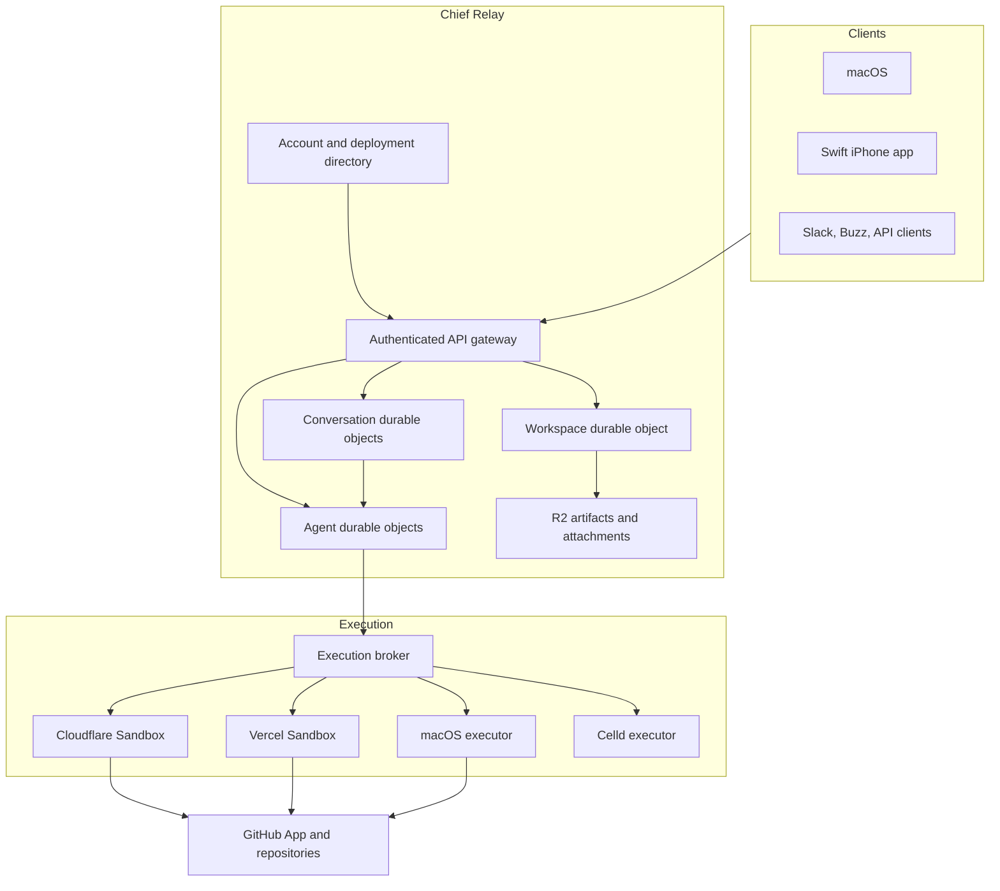

# Chief Relay platform

Status: authoritative greenfield specification

This document defines the shared workspace, durable-agent, execution, project,
deployment, and mobile foundations for Chief. It supersedes the host-specific
architecture in `agent-runtime-platform-prd.md` and the runtime portions of the
earlier Projects PRDs. Existing workspaces do not require migration.

## Product decision

Chief is a collaboration system whose workspace remains available when every
member's computer is closed. The Chief Relay is the authority for shared state.
Desktop, mobile, Slack, Buzz, and future clients consume the same versioned
protocol.

The relay is not a Git forge and it is not an agent computer.

- GitHub remains the first canonical Git provider.
- Durable agent cells coordinate persistent agents.
- Isolated executors run code, browsers, tests, and full Git.
- Eve-compatible files describe agents without owning their runtime state.
- Celld is an optional local or mobile placement, not the team workspace host.

## Goals

1. Keep workspaces available to teams and agents without a desktop process.
2. Make every accepted message durable before it appears successful.
3. Give each workspace agent one persistent identity across conversations.
4. Support Chief Cloud, customer-owned Cloudflare, and local-only deployments.
5. Keep agent definitions portable across Cloudflare, Vercel, macOS, and Celld.
6. Run untrusted work only in isolated, capability-scoped executors.
7. Make GitHub access short-lived, repository-scoped, and auditable.
8. Publish a documented API and conformance suite before adding more clients.
9. Provide a native Swift client that never depends on a member's Mac being on.
10. Allow later Slack and Buzz clients without requiring the Chief UI.

## Non-goals

- Migrating existing local workspaces.
- Preserving the current Vercel, Eve, Convex, or SQLite orchestration paths.
- Hosting Git repositories inside Chief.
- Implementing GitLab and Bitbucket before the GitHub adapter is trustworthy.
- Treating a phone as an always-on collaboration server.
- Reproducing every Cloudflare Durable Object API in Chief abstractions.
- Running one active copy of the same agent in multiple placements.

## Product principles

### Persist before publish

A relay command is successful only after the authoritative transaction commits.
WebSockets, notifications, caches, and projections are downstream delivery.

### One command, one durable effect

Every mutation carries a client-generated idempotency key. A retry returns the
original result and cannot append a duplicate message, reaction, approval, or
agent task.

### Authority is an intersection

An operation is allowed only when every relevant boundary permits it:

```text
authenticated principal
AND workspace membership
AND role permission
AND explicit agent or project capability
AND provider permission
AND execution policy
```

No single approval, token, or model request bypasses the other boundaries.

### Specifications are portable; state is durable

Agent files describe identity, voice, tools, skills, and files. A cell owns the
inbox, outbox, checkpoints, schedules, working memory, and placement lease.

### Full Git belongs in an executor

Celld's bounded Git proves portability but is not the production Git engine.
Cloud and macOS executors use full Git. A phone delegates unsupported remote Git
operations through the same project API.

### Self-hosting is real

A customer-owned deployment must continue operating without a request to Chief
Cloud. The infrastructure administrator controls that deployment and its data.

## System topology



## Deployment editions

### Chief Cloud

Chief operates the relay, durable cells, storage, executor broker, billing, and
observability. Workspaces are tenant-isolated within managed infrastructure.
Higher-assurance customers may receive a dedicated deployment.

Inference may be included under plan limits or use customer-owned provider keys.
Infrastructure and model usage are metered separately.

### Chief BYOC

The customer deploys the same relay bundle into their Cloudflare account. The
deployment provisions Durable Objects, D1, R2, Queues, and secrets. It owns its
identity store, data, GitHub App, model credentials, and billing relationship
with infrastructure providers.

Chief may provide software updates and diagnostics only when explicitly enabled.

### Local-only

The desktop runs the portable contracts against local SQLite and macOS
executors. Local-only is single-device and is not presented as collaborative or
always-on. A user may later create a new hosted workspace; no legacy migration is
required for the initial release.

## Relay protocol

The public protocol is versioned under `/v1`. JSON schemas are the source of
truth for HTTP bodies, events, and generated OpenAPI documentation.

### Required discovery endpoints

- `GET /.well-known/chief-relay`
- `GET /health`
- `GET /v1/openapi.json`
- `GET /docs`

Discovery returns the relay ID, deployment edition, protocol versions,
authentication methods, region, and advertised capabilities. It never exposes
secret configuration.

### Command envelope

```ts
type RelayCommand<T> = {
  commandId: string;
  protocolVersion: 1;
  workspaceId: string;
  occurredAt: string;
  payload: T;
};
```

The client never supplies the trusted actor. The gateway derives the principal
from the authenticated session and passes it through a private internal request.

### Event envelope

```ts
type RelayEvent<T> = {
  eventId: string;
  sequence: number;
  protocolVersion: 1;
  workspaceId: string;
  streamId: string;
  type: string;
  actor: { type: "user" | "agent" | "service"; id: string };
  correlationId: string;
  causationId?: string;
  occurredAt: string;
  payload: T;
};
```

Sequences are scoped to a stream. Clients catch up by cursor and then attach a
WebSocket. A reconnect always asks for missed committed events before displaying
the connection as current.

### Mutation semantics

1. Authenticate the session.
2. Resolve the workspace from trusted session and route state.
3. Authorize membership, role, and capability.
4. Begin the authoritative object transaction.
5. Return an earlier receipt when `commandId` already exists.
6. Persist domain state, event, and outbox records atomically.
7. Commit.
8. Return the durable receipt.
9. Notify WebSockets and asynchronous consumers.

## State ownership

### Deployment directory

Owns accounts, relay discovery, subscription state, deployment health, and
workspace routing. It must not become a second message or agent state store.

Chief Cloud may operate this centrally. BYOC uses a local directory and does not
require Chief Cloud.

### Workspace object

One object per workspace owns:

- workspace profile and policy
- members, roles, invitations, and service principals
- channel and direct-message indexes
- agent registry and placement metadata
- project references and workspace-level grants
- monotonically ordered audit metadata

It does not store full conversation histories.

### Conversation object

One object per channel or direct message owns:

- messages and component payloads
- threads and replies
- reactions
- read markers
- attention state
- conversation WebSockets
- idempotency receipts and an event outbox

The object is reachable only through a gateway request carrying a verified,
short-lived internal authorization assertion.

### Agent object

One object per `{workspaceId, agentId}` owns:

- durable inbox and outbox
- turn and tool checkpoints
- schedules and next alarm
- working memory and conversation summaries
- current task and cancellation state
- current placement lease and epoch
- references to artifacts, checkouts, grants, and execution receipts

The cell is a workspace participant. It sends messages by calling the relay API,
not by returning text that another process may or may not mirror later.

### Object storage

R2 stores attachments, exported snapshots, large artifacts, and encrypted backup
objects. Operational messages, permissions, and secret values do not live in R2.

All object keys begin with a deployment and workspace namespace. Authorization
is evaluated before issuing a short-lived object URL.

## Durable agent model

### Agent package

The portable package is intentionally file-based:

```text
agent/
  agent.yaml
  AGENT.md
  tools/
  skills/
  files/
  tests/
```

`agent.yaml` declares stable identity, supported roles, requested capabilities,
entrypoints, schedules, memory policy, and minimum runtime contract. `AGENT.md`
contains voice and operating instructions. Tool and skill folders remain
compatible with Eve packaging where practical.

The compiler emits a signed manifest with content hashes. Runtime-specific
artifacts are derived output and never become the source of truth.

### Runtime contract

```ts
interface AgentCellRuntime {
  enqueue(input: AgentInboxInput): Promise<EnqueueReceipt>;
  claimTurn(input: ClaimTurnInput): Promise<TurnLease>;
  checkpoint(input: TurnCheckpoint): Promise<void>;
  complete(input: CompleteTurnInput): Promise<void>;
  cancel(input: CancelTurnInput): Promise<void>;
  schedule(input: ScheduleInput): Promise<void>;
  exportSnapshot(input: ExportSnapshotInput): Promise<EncryptedSnapshot>;
}
```

Cloudflare Durable Objects are the first hosted implementation. Celld and the
desktop implement the same Chief contract, not every Cloudflare API.

### Placement lease

An agent has one active placement and monotonically increasing epoch. Every
turn, tool result, and outbound message includes that epoch. Stale placements
cannot publish after a handoff.

Handoff is stop, checkpoint, export, import, claim, and resume. It is not
multi-master replication.

## Execution plane

The broker selects an executor by placement, required capabilities, data policy,
cost, and availability.

```ts
interface ExecutorProvider {
  create(input: CreateExecutionInput): Promise<ExecutionLease>;
  exec(input: ExecInput): Promise<ExecResult>;
  readFile(input: ReadFileInput): Promise<FileResult>;
  writeFile(input: WriteFileInput): Promise<void>;
  snapshot(input: SnapshotInput): Promise<SnapshotReference>;
  destroy(input: DestroyExecutionInput): Promise<void>;
}
```

Initial providers:

- Cloudflare Sandbox for BYOC and Chief Cloud defaults
- Vercel Sandbox as a first-class alternative executor
- macOS for approved local work
- Celld for bounded offline work
- deterministic fixture executor for tests

Vercel Workflow may implement long-running orchestration in a Vercel-hosted
adapter, while Vercel Queues may carry adapter events. Neither is allowed to
change public relay semantics. The same conformance suite applies.

## Projects and Git

Projects are workspace-shared references to provider repositories. GitHub is
canonical for the first hosted release.

### Permission intersection

Every operation evaluates:

1. workspace membership
2. project role
3. approved agent capabilities
4. GitHub App installation and selected repositories
5. short-lived token permissions
6. branch protection and review policy
7. active execution lease

### Credentials

Chief Cloud uses the Chief GitHub App. BYOC creates a customer-owned private app
through GitHub's manifest flow. Installation tokens are minted just in time for
the exact repository and permissions and are never stored in cell memory,
messages, artifacts, or Git configuration after the lease ends.

Local Git may use the operating system credential helper. A personal access
token is a compatibility fallback, never the preferred onboarding path.

### Agent branches

An agent receives an isolated checkout and a stable workspace identity. Branch
names include the workspace-safe agent identity and task. Direct pushes to
protected branches are denied. Commits, checks, reviews, and pull requests are
project events rendered through the provider-neutral Projects UI.

## Authentication and tenant isolation

### User authentication

Chief Cloud uses the existing Chief account identity during the first release.
BYOC must own its session database and support passkeys plus recovery codes.
OIDC and enterprise SSO are later provider modules.

The bootstrap path is one-time, explicitly claimed, and permanently disabled
after the first owner is established.

### Internal authentication

Public bearer tokens never flow directly between Durable Objects. The gateway
validates them and issues a short-lived internal assertion containing the
principal, workspace, permitted operation, audience, expiry, and nonce.

### Isolation rules

- Public storage keys never rely on a client-provided workspace ID.
- Cache keys begin with deployment, workspace, and resource IDs.
- Object routes validate the internal assertion audience and object identity.
- Executor networks deny metadata services and private control-plane addresses.
- Logs redact credentials and user content by default.
- Managed sensitive payloads support per-workspace envelope keys.
- Export and deletion cover relational, object, durable, and search data.

## API documentation

The relay ships documentation with the runtime:

- OpenAPI 3.1 JSON generated from the versioned schemas
- an interactive `/docs` explorer
- copyable curl and TypeScript examples
- WebSocket event schema and reconnect protocol
- authentication and idempotency guides
- agent tool documentation
- a machine-readable discovery document

The docs web experience may be hosted on `heychief.sh`, but it reads the same
versioned artifacts shipped by the relay package. Documentation cannot drift
from the tested schemas.

## One-click deployment

The deployable relay is published as an isolated public template because hosted
deploy buttons do not reliably resolve private monorepo workspace dependencies.

### Cloudflare flow

1. User chooses self-host during Chief onboarding.
2. Chief creates a local deployment draft and recovery material.
3. User opens Deploy to Cloudflare.
4. Cloudflare provisions Worker, Durable Objects, D1, R2, Queues, and secrets.
5. The deployment redirects to `heychief.sh/relay/complete` with non-secret IDs.
6. Chief verifies `/.well-known/chief-relay` and claims the first owner.
7. The desktop stores its device credential in Keychain.
8. The relay presents GitHub App setup and optional model-provider connections.
9. A QR/deep link enrolls the Swift client.

Manual secret copy and generated-key ceremonies are a fallback, not the primary
experience.

### Managed flow

Chief creates a workspace in the managed deployment and completes onboarding in
place. The user sees the same connection status and can export or delete data.

## Swift mobile client

The initial SwiftUI app is a relay client with:

- relay and workspace switcher
- channel and DM lists
- messages, threads, reactions, and typing state
- requires-attention inbox and approval cards
- agent activity and cancellation
- attachments, notifications, and deep links
- Projects browsing, commits, diffs, and reviews
- encrypted local cache and resumable event cursors

The cache is namespaced by relay and workspace. Switching tenants clears active
view state before hydrating the next namespace.

Celld is added later for offline or private local agents. Unsupported Git,
browser, or long-running work is delegated to the hosted executor. iOS
background tasks improve continuity but never claim always-on availability.

## Reliability model

- Commands are at-least-once and effects are idempotent.
- Outboxes are stored in the same transaction as domain events.
- WebSocket delivery is replayable from durable cursors.
- Agent turns have leases, heartbeats, deadlines, and checkpoints.
- Completion is published only after agent output is durably appended.
- Schedules tolerate duplicate alarms and missed wakeups.
- Provider webhooks are deduplicated by delivery ID.
- Every external call has a timeout and bounded retry policy.
- Dead letters are visible in diagnostics and can be replayed safely.

## Observability

Every trace includes deployment, workspace, conversation, agent, command,
correlation, causation, execution, and provider IDs where applicable.

Required views:

- relay health and version
- event and outbox lag
- active WebSockets and reconnect rate
- agent inbox age, lease, and checkpoint
- executor lifecycle and resource use
- project authorization decisions
- webhook delivery and replay
- redacted audit timeline

Vercel and Cloudflare adapters may expose native dashboards, but Chief's
diagnostic vocabulary remains identical.

## Testing

### Contract suite

Every relay adapter passes tests for authentication, tenant routing,
idempotency, event order, cursor replay, revocation, and redaction.

Every cell adapter passes tests for enqueue, lease exclusion, checkpoint,
resume, cancellation, alarm duplication, placement epochs, and snapshot import.

Every executor passes tests for isolation, limits, cancellation, snapshots,
credential lifetime, and cleanup.

### Deterministic workspace harness

The harness creates a disposable workspace, members, channels, agents, and
projects; records every event; injects crashes and disconnects; verifies expected
outcomes; and destroys all state. Live inference tests remain explicitly opted
in and use the configured approved model only.

### Required failure tests

- desktop closes after a message is acknowledged
- relay object hibernates during an open socket
- agent crashes before and after checkpoint
- duplicate command and webhook delivery
- stale placement attempts to publish
- member removed while connected
- project grant revoked during a checkout
- executor destroyed mid-command
- mobile reconnects after missing events
- tenant IDs are maliciously substituted in every public request shape

## Delivery plan

### Foundation

- publish protocol schemas and OpenAPI
- implement pure in-memory reference state machines
- add Cloudflare Worker and Durable Object adapters
- add local conformance and fault-injection tests
- ship discovery, health, and bootstrap skeleton

### Collaboration

- implement membership, conversations, durable messages, reactions, and cursors
- connect the desktop directly to the relay
- delete mirrored and legacy local-authority paths
- add invites, device enrollment, and notification delivery

### Durable agents

- compile portable agent packages
- implement agent inbox, outbox, schedules, checkpoints, and placement leases
- connect message and reaction tools directly to the relay
- add Cloudflare and Vercel executor adapters

### Projects

- connect the existing Projects UI to relay project state
- finish GitHub App installation and token broker
- run Git operations only inside approved executors
- implement commits, diffs, pull requests, reviews, and webhooks

### Deployment

- publish the isolated Cloudflare template
- integrate deployment into onboarding
- add managed workspace creation, billing, export, restore, and deletion
- publish operational and API documentation

### Mobile

- build the SwiftUI relay client
- add push notifications and deep links
- add Projects and approvals
- add optional Celld placement after hosted reliability gates pass

## Release gates

### Relay foundation

- API schemas generate documentation and pass compatibility tests.
- Tenant substitution tests fail closed.
- Acknowledged messages survive restart and reconnect.
- Duplicate commands produce one event.

### Collaboration

- Two devices can share a workspace while the original Mac is offline.
- A reconnect catches up without duplicates or missing messages.
- Membership revocation terminates subsequent reads and writes.

### Agents

- An agent survives runtime restart from a durable checkpoint.
- Exactly one placement may publish for an agent epoch.
- Replies and reactions are committed through relay tools.
- A failed executor does not lose the accepted task.

### Projects

- No long-lived provider credential enters an agent cell.
- Project operations require every permission layer.
- Revocation prevents the next provider call.
- A complete branch, commit, test, push, and PR flow is auditable.

### Deployment

- A new user can create a managed workspace from onboarding.
- A customer can deploy and claim BYOC without editing source.
- BYOC continues to operate with Chief Cloud unavailable.
- Backup, export, restore, and deletion are verified.

### Mobile

- The app joins a workspace without the desktop being online.
- Push deep links open the exact conversation or approval.
- Offline cache never crosses relay or workspace namespaces.

## Decisions locked for implementation

1. Chief Relay is the authority for collaborative workspace state.
2. Cloudflare Durable Objects are the first hosted durable-state adapter.
3. GitHub remains the first canonical Git provider.
4. Chief does not host Git in this release.
5. Full Git runs in cloud or macOS executors.
6. An agent is one durable cell per workspace, not per conversation.
7. Eve-compatible files remain a specification format, not the state store.
8. Cloudflare and Vercel are provider adapters behind Chief contracts.
9. The initial mobile app is a Swift relay client.
10. Existing workspaces and legacy orchestration paths need no migration.

