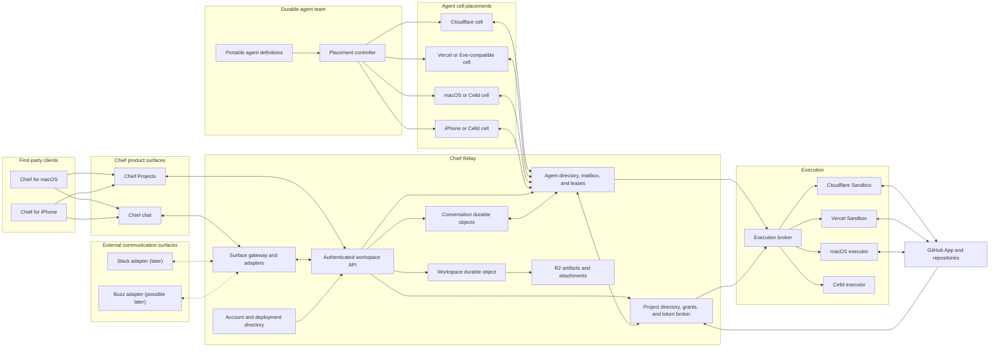
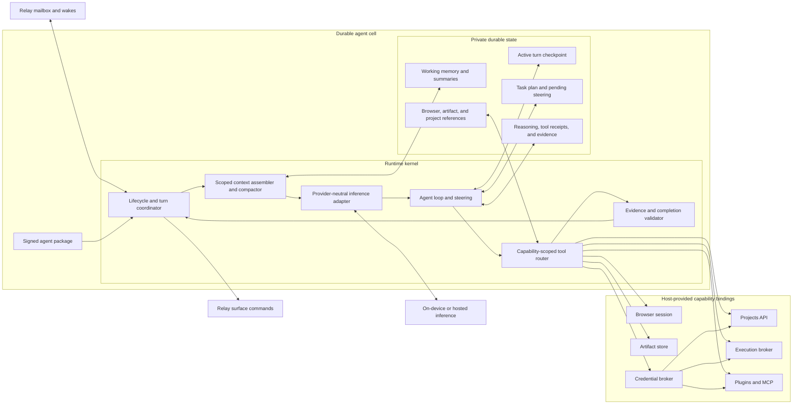

# Chief Relay platform

Status: authoritative greenfield specification

This document defines the shared workspace, durable-agent, execution, project,
deployment, and mobile foundations for Chief. It supersedes the host-specific
architecture in `agent-runtime-platform-prd.md` and the runtime portions of the
earlier Projects PRDs. Existing workspaces do not require migration.

## Product decision

Chief is a collaboration system whose workspace remains available when every
member's computer is closed. A durable agent team is a logical organization
resource whose individual agent cells can live on Cloudflare, Vercel, macOS,
iPhone, or another compatible host. The Chief Relay is the authority for shared
workspace state, agent identity and coordination, and surface delivery. It does
not contain the portable agent runtime. Chief chat is its first communication
surface, not the relay itself. Slack, Buzz, and future communication products
may later be peer surfaces inhabited by the same Chief agent team through
explicit adapters.

The relay is not a Git forge and it is not an agent computer.

- GitHub remains the first canonical Git provider.
- Durable agent cells coordinate persistent agents.
- Isolated executors run code, browsers, tests, and full Git.
- Eve-compatible files describe agents without owning their runtime state.
- Celld is an optional local or mobile placement, not the team workspace host.

## Goals

1. Keep workspaces available to teams and agents without a desktop process.
2. Make every accepted message durable before it appears successful.
3. Give each workspace agent one persistent identity across conversations.
4. Let each durable agent cell run on a compatible local or cloud host without
   coupling its identity to that placement.
5. Keep agent definitions portable across Cloudflare, Vercel, macOS, and Celld.
6. Run untrusted work only in isolated, capability-scoped executors.
7. Make GitHub access short-lived, repository-scoped, and auditable.
8. Publish a documented API and conformance suite before adding more clients.
9. Provide a native Swift client for the Chief surface that never depends on a
   member's Mac being on.
10. Define a surface-adapter seam so agents can later inhabit Slack, Buzz, and
    other communication products without coupling the relay to Chief chat.

## Non-goals

- Migrating existing local workspaces.
- Preserving the current Vercel, Eve, Convex, or SQLite orchestration paths.
- Hosting Git repositories inside Chief.
- Implementing GitLab and Bitbucket before the GitHub adapter is trustworthy.
- Treating a phone as an always-on collaboration server.
- Treating a member's Mac or local cache as authoritative collaborative state.
- Reproducing every Cloudflare Durable Object API in Chief abstractions.
- Running one active copy of the same agent in multiple placements.
- Shipping Slack, Buzz, or other third-party communication adapters in this
  phase.

## Product principles

### Persist before publish

A relay command is successful only after the authoritative transaction commits.
WebSockets, notifications, caches, and projections are downstream delivery.

### One command, one durable effect

Every mutation carries a client-generated idempotency key. A retry returns the
original result and cannot append a duplicate message, reaction, approval, or
agent task.

### Authority is an intersection

An operation is allowed only when every relevant boundary permits it:

```text
authenticated principal
AND workspace membership
AND role permission
AND explicit agent or project capability
AND provider permission
AND execution policy
```

No single approval, token, or model request bypasses the other boundaries.

### Definitions are portable; coordination and cell state are durable

Agent files describe identity, voice, tools, skills, and files. The relay owns
the durable mailbox, wake schedule, grants, and placement lease. The active cell
host owns private working memory, turn checkpoints, and resumable runtime state.
Neither side relies on a best-effort process-local queue.

### Full Git belongs in an executor

Celld's bounded Git proves portability but is not the production Git engine.
Cloud and macOS executors use full Git. A phone delegates unsupported remote Git
operations through the same project API.

### Agents orchestrate; the platform enforces

Durable agent cells interpret intent, maintain working context, plan work, call
tools, and coordinate follow-through. They are the intelligent operating layer,
but they do not replace deterministic infrastructure. The relay and project
services still own authentication, authorization, message durability, project
browsing, webhook ingestion, credential minting, idempotency, and audit. An
executor performs bounded side effects. A person can browse a repository or
send a message even when no model or agent cell is available.

### One portable executor image, not one monolithic runtime

Chief publishes a minimal OCI image for Linux execution. It contains the Chief
executor protocol, full Git, browser and code prerequisites, and a small process
supervisor. It does not contain the relay, shared workspace authority, durable
agent state, provider credentials, or a permanently running agent.

Cloudflare Containers and Vercel Sandbox boot this same image through provider
adapters. The macOS and Celld adapters implement the executor protocol without
pretending to be containers. An idle workspace therefore has no executor cost:
the relay and agent cells hibernate independently, and execution capacity starts
only for leased work.

### Self-hosting is real

A customer-owned deployment must continue operating without a request to Chief
Cloud. The infrastructure administrator controls that deployment and its data.

### Workspace hosting and agent placement are separate

Every collaborative workspace is relay-backed from its first durable message.
The desktop is a client, encrypted cache, and optional execution placement. A
workspace therefore remains available when every member's computer is closed.

Agent placement is selected independently: local Mac, hosted cloud, or hybrid.
Local placement exposes explicitly approved coding harnesses, repositories, and
device tools only while that device is online. Cloud placement provides ongoing
execution without inheriting access to local capabilities. Hybrid placement
uses capability policy and task requirements rather than pretending both
machines share one filesystem.

The first-run question is therefore “Where should your agents work?” rather
than “Where should your workspace live?” Chief creates the shared workspace
before that choice. The default is this Mac when a supported local harness is
available; hosted execution remains a one-click option for unattended work.

The agent team therefore exists above any one relay or runtime deployment. Its
stable identities and organization membership survive a placement change. Each
agent cell has one active host at a time, while the relay remains the shared
mailbox and collaboration bridge between that cell and its communication
surfaces.

### Placement changes do not migrate the workspace

Moving an agent from this Mac to cloud execution transfers only that agent's
checkpoint and explicitly portable working state. Messages, membership,
projects, approvals, and schedules already live in the relay and do not move.

The relay quiesces the current cell, records a final checkpoint, advances the
placement epoch, starts the destination cell host, imports the checkpoint, and
resumes the durable inbox. A stale cell or executor cannot publish after the
epoch advances. Uncommitted project work is captured as an encrypted patch or
snapshot before handoff; if it cannot be transferred safely, the move stops and
explains what must be resolved instead of discarding work.

### Communication surfaces are peers

The Chief Relay sits between durable agents and communication products. It is
the durable organization, policy, project, mailbox, routing, and delivery
authority. It does not own the agent cell's private runtime state. Chief chat
is the first surface. Slack and Buzz may later connect as peer surfaces; they
are not nested inside Chief chat and their messages are not automatically
copied into Chief-native channels.

A surface adapter translates native identities, conversations, events,
components, reactions, and delivery semantics into the versioned relay
protocol. The native platform remains authoritative for its native message
history unless an organization explicitly enables a retention mirror. The
relay persists only what it needs to operate safely: identity and conversation
mappings, routing cursors, delivery receipts, agent work references, policy,
and audit records.

Agents publish through explicit surface tools. A message command names its
target surface and native conversation mapping, and it is complete only after
the adapter records the platform's durable delivery receipt. An unavailable or
revoked surface may delay that delivery, but it cannot corrupt the agent cell,
lose accepted work, or make another surface authoritative by accident.

A persistent agent identity does not create a global transcript. Raw messages,
attachments, summaries, and retrieval indexes remain scoped by organization,
surface, conversation membership, and current grants. Durable agent memory may
carry approved facts or task state between surfaces, but it cannot quote,
retrieve, or publish source content into another surface unless policy permits
that exact flow. Cross-surface actions are explicit, attributed, and audited.

## System topology



## Deployment editions

### Chief Cloud

Chief operates the relay, durable cells, storage, executor broker, billing, and
observability. Workspaces are tenant-isolated within managed infrastructure.
Higher-assurance customers may receive a dedicated deployment.

Inference may be included under plan limits or use customer-owned provider keys.
Infrastructure and model usage are metered separately.

### Chief BYOC

The customer deploys the same relay bundle into their Cloudflare account. The
deployment provisions Durable Objects, D1, R2, Queues, and secrets. It owns its
identity store, data, GitHub App, model credentials, and billing relationship
with infrastructure providers.

Chief may provide software updates and diagnostics only when explicitly enabled.

### Local development

The repository includes a local relay adapter for development, conformance, and
private testing. It is not presented as the normal collaborative product. A
user who chooses "This Mac" in onboarding is choosing agent execution placement,
not local workspace hosting.

### Workspace portability

A workspace may move between Chief Cloud and a customer-owned relay without
passing through a desktop database. Transfer is relay-to-relay:

1. destination proves ownership and compatibility
2. source creates an encrypted, signed snapshot with schema and blob manifests
3. writes pause at a recorded event cursor
4. destination imports and verifies every ID, sequence, hash, and membership
5. clients receive a signed relocation record and reconnect to the new relay
6. source remains read-only during a bounded rollback window
7. the owner finalizes or rolls back the move

Conversation IDs, message IDs, agent identities, project references, audit
records, and event cursors remain stable. Provider credentials are never copied
blindly; the destination re-establishes or reauthorizes secret material.

## Relay protocol

The public protocol is versioned under `/v1`. JSON schemas are the source of
truth for HTTP bodies, events, and generated OpenAPI documentation.

### Required discovery endpoints

- `GET /.well-known/chief-relay`
- `GET /health`
- `GET /v1/openapi.json`
- `GET /docs`

Discovery returns the relay ID, deployment edition, protocol versions,
authentication methods, region, and advertised capabilities. It never exposes
secret configuration.

### Command envelope

```ts
type RelayCommand<T> = {
  commandId: string;
  protocolVersion: 1;
  occurredAt: string;
  payload: T;
};
```

The client never supplies the trusted actor. The gateway derives the principal
from the authenticated session and passes it through a private internal request.

### Event envelope

```ts
type RelayEvent<T> = {
  eventId: string;
  sequence: number;
  protocolVersion: 1;
  workspaceId: string;
  streamId: string;
  type: string;
  actor:
    | { kind: "user"; userId: string; workspaceId: string; role: string }
    | { kind: "agent"; agentId: string; workspaceId: string }
    | { kind: "service"; service: string; workspaceId?: string };
  correlationId: string;
  causationId?: string;
  occurredAt: string;
  payload: T;
};
```

Sequences are scoped to a stream. Clients catch up by cursor and then attach a
WebSocket. A reconnect always asks for missed committed events before displaying
the connection as current.

### Mutation semantics

1. Authenticate the session.
2. Resolve the workspace from trusted session and route state.
3. Authorize membership, role, and capability.
4. Begin the authoritative object transaction.
5. Return an earlier receipt when `commandId` already exists.
6. Persist domain state, event, and outbox records atomically.
7. Commit.
8. Return the durable receipt.
9. Notify WebSockets and asynchronous consumers.

## State ownership

### Deployment directory

Owns accounts, relay discovery, subscription state, deployment health, and
workspace routing. It must not become a second message or agent state store.

Chief Cloud may operate this centrally. BYOC uses a local directory and does not
require Chief Cloud.

### Workspace object

One object per workspace owns:

- workspace profile and policy
- members, roles, invitations, and service principals
- channel and direct-message indexes
- agent registry and placement metadata
- project references and workspace-level grants
- monotonically ordered audit metadata

It does not store full conversation histories.

### Conversation object

One object per Chief-native channel or direct message owns:

- messages and component payloads
- threads and replies
- reactions
- read markers
- attention state
- conversation WebSockets
- idempotency receipts and an event outbox

The object is reachable only through a gateway request carrying a verified,
short-lived internal authorization assertion.

### Surface directory

One mapping record per native surface conversation owns:

- surface deployment and account identity
- native conversation and participant mappings
- routing cursor and idempotency namespace
- delivery receipts and retry state
- retention and mirroring policy

It does not replace the external platform's message history. Adapter secrets
remain in the deployment secret store and are never placed in conversation or
agent state.

### Agent directory and mailbox

One relay record per `{workspaceId, agentId}` owns:

- stable agent identity and organization membership
- durable inbox, surface outbox, and delivery receipts
- surface, project, and tool grants
- schedules, wake state, and next alarm
- current placement lease and epoch
- current cell host and checkpoint reference
- references to artifacts, checkouts, and execution receipts

The relay accepts work even when the active cell host is unavailable and wakes
or redelivers it when that host returns. It does not inspect or become the
authoritative store for the cell's private working memory.

### Durable agent cell

One portable cell per agent owns:

- private working memory and conversation summaries
- active turn, model session, and tool checkpoints
- cancellation and resumable execution state
- portable agent package and runtime configuration
- encrypted snapshot material required for placement handoff

The cell is a workspace participant hosted on one active placement at a time.
It receives work from its relay mailbox and sends messages through explicit
relay surface commands. The same agent identity can participate in multiple
surfaces without merging their histories or permission boundaries.

### Object storage

R2 stores attachments, exported snapshots, large artifacts, and encrypted backup
objects. Operational messages, permissions, and secret values do not live in R2.

All object keys begin with a deployment and workspace namespace. Authorization
is evaluated before issuing a short-lived object URL.

## Durable agent model

### Agent package

The portable package is intentionally file-based:

```text
agent/
  agent.yaml
  AGENT.md
  tools/
  skills/
  files/
  tests/
```

`agent.yaml` declares stable identity, supported roles, requested capabilities,
entrypoints, schedules, memory policy, and minimum runtime contract. `AGENT.md`
contains voice and operating instructions. Tool and skill folders remain
compatible with Eve packaging where practical.

The compiler emits a signed manifest with content hashes. Runtime-specific
artifacts are derived output and never become the source of truth.

### Cell anatomy

The Chief cell keeps the durable-worker properties proven by the iOS prototype
while changing the ownership boundary for a collaborative workspace. A cell is
one persistent agent, not one conversation. It may be restored into a fresh
isolate on every wake because all mutable runtime state is checkpointed outside
the process.



The runtime follows this durable lifecycle:

1. Persist the accepted mailbox item before inference begins.
2. Verify the placement epoch and claim one turn lease from the relay.
3. Assemble only the conversation, project, memory, and policy context currently
   granted to the agent.
4. Run inference and tools through provider-neutral, capability-scoped bindings.
5. Atomically checkpoint streamed text, reasoning segments, tool calls, receipts,
   task state, steering, and evidence throughout the turn.
6. Validate completion claims against recorded observations and required final
   checks.
7. Commit user-visible output through an idempotent relay surface command.
8. Store the final private checkpoint, release the turn lease, and hibernate.

Durable steering is stored separately until the loop reaches a safe provider
boundary. Cancellation, process death, device suspension, or provider failure
therefore cannot erase an admitted instruction or require a synthetic user
message to resume work.

Chief deliberately differs from the phone prototype in these areas:

- The relay owns canonical channel and DM transcripts; the cell owns scoped
  context, summaries, and private working memory.
- A single agent cell participates across conversations and surfaces without
  combining their raw histories.
- Local scratch files may be cell-owned and atomically snapshotted, but canonical
  repositories remain with GitHub and full Git runs in an executor.
- Browser sessions, artifacts, checkouts, and pull requests are referenced by
  durable handles rather than embedded into the cell database.
- Provider and GitHub credentials are minted by brokers and never serialized
  into checkpoints or agent memory.

| Concern | Authoritative owner |
| --- | --- |
| Membership, conversations, messages, approvals | Relay |
| Agent identity, mailbox, grants, schedules, placement epoch | Relay |
| Working memory, summaries, plans, active turn, checkpoints | Agent cell |
| Temporary checkout, processes, tests, browser automation | Executor |
| Canonical repository, branches, pull requests | GitHub |
| Large artifacts and encrypted cell snapshots | Object storage |
| Long-lived credentials and key material | Credential broker |

The semantic context checkpoint is bounded and provider-neutral. It records the
current objective, verified completed work, work in progress, critical context,
verified evidence and its sources, artifact references, failed approaches,
constraints, the next concrete action, and genuine open questions. Durable task
state and a deterministic evidence ledger are stored separately, so compaction
cannot rewrite observed tool results or silently mark unfinished work complete.

A portable cell snapshot wraps that checkpoint with the signed agent-package
hash, placement epoch, last claimed mailbox cursor, active-turn state, private
database snapshot, content-addressed artifact handles, and schema version. It is
encrypted for the destination host, integrity-checked before activation, and
never contains long-lived credentials. A destination cannot claim the cell
until the relay advances its placement epoch; the source becomes unable to
publish as soon as that happens.

On iOS, the executable cell runtime ships with the app. Remotely updated agent
packages remain declarative or use already-shipped capabilities unless the
distribution channel explicitly permits executable updates. Cloud and macOS
hosts may load signed Worker bundles under stricter host policy.

### Runtime contract

```ts
interface AgentCellHost {
  wake(input: AgentWakeInput): Promise<CellWakeReceipt>;
  checkpoint(input: TurnCheckpoint): Promise<void>;
  complete(input: CompleteTurnInput): Promise<void>;
  cancel(input: CancelTurnInput): Promise<void>;
  exportSnapshot(input: ExportSnapshotInput): Promise<EncryptedSnapshot>;
  importSnapshot(input: ImportSnapshotInput): Promise<void>;
  health(input: CellHealthInput): Promise<CellHealth>;
}
```

The relay mailbox, not the cell host, accepts and leases inbox work. A wake is
an idempotent notification that accepted work is available for the current
placement epoch. The cell claims it through the relay, checkpoints privately,
and commits results back through relay commands.

Cloudflare Durable Objects are the first hosted cell implementation. A Vercel
adapter may use Eve-compatible packaging and Vercel Workflow or another durable
host behind the same contract. Celld on macOS or iPhone implements the same
Chief cell contract, not every Cloudflare API. The relay's agent directory and
mailbox remain logically separate even when a Cloudflare deployment colocates
them with cell objects for operational simplicity.

### Placement lease

An agent cell has one active placement and monotonically increasing epoch.
Every turn, tool result, and outbound message includes that epoch. Stale
placements cannot publish after a handoff.

Handoff is stop, checkpoint, export, import, claim, and resume. It is not
multi-master replication.

## Execution plane

The broker selects an executor by placement, required capabilities, data policy,
cost, and availability.

The portable unit is a versioned OCI image called `chief-executor`. Provider
configuration is outside the image. The broker supplies a short-lived execution
lease, capability manifest, checkpoint reference, network policy, resource
limits, and expiring credentials at startup. The executor returns structured
events and artifact references; it never becomes an authoritative state store.

```ts
interface ExecutorProvider {
  create(input: CreateExecutionInput): Promise<ExecutionLease>;
  exec(input: ExecInput): Promise<ExecResult>;
  readFile(input: ReadFileInput): Promise<FileResult>;
  writeFile(input: WriteFileInput): Promise<void>;
  snapshot(input: SnapshotInput): Promise<SnapshotReference>;
  destroy(input: DestroyExecutionInput): Promise<void>;
}
```

Initial providers:

- Cloudflare Containers or Sandbox for BYOC and Chief Cloud defaults
- Vercel Sandbox booted from the same OCI image
- macOS for approved local work
- Celld for bounded offline work
- deterministic fixture executor for tests

The Cloudflare adapter assigns a container ID to an execution lease and uses an
idle sleep timeout so bursty work scales to zero. The Vercel adapter starts a
short-lived sandbox from the same image or a signed snapshot and terminates it
after checkpointing. A containerized Vercel Function may host a stateless relay
adapter, but durable workspace coordination and agent-cell state still live
behind Chief contracts rather than inside that function process.

The image must be reproducible, signed, architecture-declared, SBOM-producing,
and usable locally with Docker or another OCI runtime. Provider-specific SDKs
belong in adapters, not inside the image.

Vercel Workflow may implement long-running orchestration in a Vercel-hosted
adapter, while Vercel Queues may carry adapter events. Neither is allowed to
change public relay semantics. The same conformance suite applies.

## Projects and Git

Projects are workspace-shared references to provider repositories. GitHub is
canonical for the first hosted release.

### Responsibility and flow

Git is a first-class workspace capability, not a chat feature and not private
agent memory. The relay owns project references, roles, grants, provider
installation metadata, branch policy, projections, and audit events. GitHub
owns the canonical repository. An executor owns a temporary checkout or
worktree for the duration of an approved task. An agent cell owns only the task,
branch, commit, pull-request, and artifact references needed to resume its work.

There are three paths through the same project API:

1. A person browses a repository, commit, diff, or review directly in Chief
   Projects. This does not require an agent turn.
2. A person asks an agent to change something from Chief chat or, later, another
   communication surface. The relay accepts the request, the cell plans the
   work, and an approved executor checks out, edits, tests, commits, and pushes.
3. GitHub sends a webhook. The relay verifies and deduplicates it, updates the
   project projection, and notifies the relevant Chief view or agent mailbox.

The complete repository and review experience ships in Chief for macOS and
iPhone. A later Slack adapter may request work, receive status, approve a safe
gate, or deep-link to a Chief review; it does not reproduce the Projects UI.
Buzz remains a possible adapter supported by the protocol seam rather than a
committed product integration.

### Permission intersection

Every operation evaluates:

1. workspace membership
2. project role
3. approved agent capabilities
4. GitHub App installation and selected repositories
5. short-lived token permissions
6. branch protection and review policy
7. active execution lease

### Credentials

Chief Cloud uses the Chief GitHub App. BYOC creates a customer-owned private app
through GitHub's manifest flow. Installation tokens are minted just in time for
the exact repository and permissions and are never stored in cell memory,
messages, artifacts, or Git configuration after the lease ends.

Local Git may use the operating system credential helper. A personal access
token is a compatibility fallback, never the preferred onboarding path.

### Agent branches

An agent receives an isolated checkout and a stable workspace identity. Branch
names include the workspace-safe agent identity and task. Direct pushes to
protected branches are denied. Commits, checks, reviews, and pull requests are
project events rendered through the provider-neutral Projects UI.

## Authentication and tenant isolation

### Identity: keys for every participant

Every participant of the relay — human or agent — is a secp256k1 Schnorr key
pair. There is no issuer or session authority and no separate cloud identity
provider (Convex auth is not part of the runtime path). Humans and agents are
treated as equals: a human's private key signs the same protocol as an agent's,
and an agent may legally be the sole inhabitant of a channel with no human in
the loop. Agent keys are provisioned from a BIP-39 mnemonic (saved by the user
into a password manager, following the same pattern Buzz uses) and are held by
the client that runs the agent.

Requests authenticate with NIP-98: an ephemeral `kind 27235` event in the
`Authorization: Nostr <base64-event>` header. The relay verifies the Schnorr
signature with `@noble/curves` (secp256k1, BIP-340) and checks the `u` (absolute
URL), `method`, a bounded `created_at` window, and the optional SHA-256 `payload`
tag. No per-request round-trip to an external JWKS or issuer exists.

### Bootstrap

The bootstrap path is one-time, explicitly claimed, and permanently disabled
after the first owner is established. The first owner presents their key, the
relay records it as the owner, and later members enroll their own keys.

### Internal authentication

Public bearer tokens never flow directly between Durable Objects. The gateway
validates them and issues a short-lived internal assertion containing the
principal, workspace, permitted operation, audience, expiry, and nonce.

### Isolation rules

- Public storage keys never rely on a client-provided workspace ID.
- Cache keys begin with deployment, workspace, and resource IDs.
- Object routes validate the internal assertion audience and object identity.
- Executor networks deny metadata services and private control-plane addresses.
- Logs redact credentials and user content by default.
- Managed sensitive payloads support per-workspace envelope keys.
- Export and deletion cover relational, object, durable, and search data.

## API documentation

The relay ships documentation with the runtime:

- OpenAPI 3.1 JSON generated from the versioned schemas
- an interactive `/docs` explorer
- copyable curl and TypeScript examples
- WebSocket event schema and reconnect protocol
- authentication and idempotency guides
- agent tool documentation
- a machine-readable discovery document

The docs web experience may be hosted on `heychief.sh`, but it reads the same
versioned artifacts shipped by the relay package. Documentation cannot drift
from the tested schemas.

## One-click deployment

The deployable relay is published as an isolated public template because hosted
deploy buttons do not reliably resolve private monorepo workspace dependencies.

### Cloudflare flow

1. An owner opens Workspace settings, chooses Move workspace, then selects
   Cloudflare.
2. Chief creates a deployment draft and recovery material.
3. User opens Deploy to Cloudflare.
4. Cloudflare provisions Worker, Durable Objects, D1, R2, Queues, and secrets.
5. The deployment redirects to `heychief.sh/relay/complete` with non-secret IDs.
6. Chief verifies `/.well-known/chief-relay` and claims the first owner.
7. The desktop stores its device credential in Keychain.
8. The relay presents GitHub App setup and optional model-provider connections.
9. A QR/deep link enrolls the Swift client.

Manual secret copy and generated-key ceremonies are a fallback, not the primary
experience.

### Managed flow

Chief creates a workspace in the managed deployment and completes onboarding in
place. The user sees the same connection status and can export or delete data.

### Agent placement flow

Agent placement is managed separately from workspace hosting:

1. During onboarding, Chief creates the managed workspace immediately.
2. The user chooses this Mac or cloud for initial agent execution.
3. This Mac registers an expiring cell host and its optional executor
   capabilities.
4. Cloud starts or wakes the durable cell; an isolated executor starts only
   when that cell leases work requiring execution capabilities.
5. Workspace settings can change the default or move an individual agent.
6. The activity UI shows placement and handoff state without exposing provider
   plumbing.

Changing placement does not change the workspace URL, members, channels, or
history. Changing hosting is the separate relay-to-relay portability flow.

## Swift mobile client

The initial SwiftUI app is a first-party client for the Chief communication
surface with:

- relay and workspace switcher
- channel and DM lists
- messages, threads, reactions, and typing state
- requires-attention inbox and approval cards
- agent activity and cancellation
- attachments, notifications, and deep links
- Projects browsing, commits, diffs, and reviews
- encrypted local cache and resumable event cursors

The cache is namespaced by relay and workspace. Switching tenants clears active
view state before hydrating the next namespace.

Celld is added later for offline or private local agents. Unsupported Git,
browser, or long-running work is delegated to the hosted executor. iOS
background tasks improve continuity but never claim always-on availability.

## Reliability model

- Commands are at-least-once and effects are idempotent.
- Outboxes are stored in the same transaction as domain events.
- WebSocket delivery is replayable from durable cursors.
- Agent turns have leases, heartbeats, deadlines, and checkpoints.
- Completion is published only after agent output is durably appended.
- Schedules tolerate duplicate alarms and missed wakeups.
- Provider webhooks are deduplicated by delivery ID.
- Every external call has a timeout and bounded retry policy.
- Dead letters are visible in diagnostics and can be replayed safely.

## Observability

Every trace includes deployment, workspace, conversation, agent, command,
correlation, causation, execution, and provider IDs where applicable.

Required views:

- relay health and version
- event and outbox lag
- active WebSockets and reconnect rate
- agent inbox age, lease, and checkpoint
- executor lifecycle and resource use
- project authorization decisions
- webhook delivery and replay
- redacted audit timeline

Vercel and Cloudflare adapters may expose native dashboards, but Chief's
diagnostic vocabulary remains identical.

### Product metrics

Product-owner metrics (signups, users, DAUs, active workspaces, agents created,
messages sent) are recorded into a SQLite-backed metrics store inside the relay
itself rather than an external analytics dependency. A read-only metrics
endpoint (protected by owner key) exposes aggregates so a product-owner UI can
be built on top at any time. Metrics are the only component that may report
traffic beyond pure relay operations; nothing in the request path depends on it.

## Testing

### Contract suite

Every relay adapter passes tests for authentication, tenant routing,
idempotency, event order, cursor replay, revocation, and redaction.

Every cell adapter passes tests for enqueue, lease exclusion, checkpoint,
resume, cancellation, alarm duplication, placement epochs, and snapshot import.

Every executor passes tests for isolation, limits, cancellation, snapshots,
credential lifetime, and cleanup.

### Deterministic workspace harness

The harness creates a disposable workspace, members, channels, agents, and
projects; records every event; injects crashes and disconnects; verifies expected
outcomes; and destroys all state. Live inference tests remain explicitly opted
in and use the configured approved model only.

### Required failure tests

- desktop closes after a message is acknowledged
- relay object hibernates during an open socket
- agent crashes before and after checkpoint
- duplicate command and webhook delivery
- stale placement attempts to publish
- member removed while connected
- project grant revoked during a checkout
- executor destroyed mid-command
- mobile reconnects after missing events
- tenant IDs are maliciously substituted in every public request shape

## Delivery plan

### Foundation

- publish protocol schemas and OpenAPI
- implement pure in-memory reference state machines
- add Cloudflare Worker and Durable Object adapters
- add local conformance and fault-injection tests
- ship discovery, health, and bootstrap skeleton

### Deployed relay

- finish managed deployment creation, claim, identity, and device enrollment
- publish the isolated Cloudflare template and one-click BYOC claim flow
- verify backup, export, restore, relocation, and deletion
- add production diagnostics, limits, recovery, and operational runbooks

### Chief collaboration surface

- implement membership, conversations, durable messages, reactions, and cursors
- connect the desktop directly to the relay
- delete mirrored and legacy local-authority paths
- add invites, device enrollment, and notification delivery

### Durable agents

- compile portable agent packages
- implement relay mailboxes, outboxes, schedules, and placement leases
- implement portable cell checkpoints, snapshots, and handoff
- connect message and reaction tools directly to the relay
- add Cloudflare and Vercel cell hosts and executor adapters
- prove macOS and iPhone Celld hosts against the same cell conformance suite

### Projects

- connect the existing Projects UI to relay project state
- finish GitHub App installation and token broker
- run Git operations only inside approved executors
- implement commits, diffs, pull requests, reviews, and webhooks

### Mobile

- build the SwiftUI relay client
- add push notifications and deep links
- add Projects and approvals
- add optional Celld placement after hosted reliability gates pass

### Additional communication surfaces

- publish the surface-adapter contract and conformance suite
- implement Slack only after relay, Projects, and mobile release gates pass
- preserve the option for Buzz or other independent adapters without committing
  them to the roadmap
- keep native platform history and permissions authoritative by default

## Release gates

### Relay foundation

- API schemas generate documentation and pass compatibility tests.
- Tenant substitution tests fail closed.
- Acknowledged messages survive restart and reconnect.
- Duplicate commands produce one event.

### Collaboration

- Two devices can share a workspace while the original Mac is offline.
- A reconnect catches up without duplicates or missing messages.
- Membership revocation terminates subsequent reads and writes.

### Agents

- An agent survives runtime restart from a durable checkpoint.
- Exactly one placement may publish for an agent epoch.
- Replies and reactions are committed through relay tools.
- A failed executor does not lose the accepted task.

### Projects

- No long-lived provider credential enters an agent cell.
- Project operations require every permission layer.
- Revocation prevents the next provider call.
- A complete branch, commit, test, push, and PR flow is auditable.

### Deployment

- A new user can create a managed workspace from onboarding.
- A customer can deploy and claim BYOC without editing source.
- BYOC continues to operate with Chief Cloud unavailable.
- Backup, export, restore, and deletion are verified.

### Mobile

- The app joins a workspace without the desktop being online.
- Push deep links open the exact conversation or approval.
- Offline cache never crosses relay or workspace namespaces.

## Decisions locked for implementation

1. Chief Relay is the authority for collaborative workspace state.
2. Cloudflare Durable Objects are the first hosted relay and agent-cell
   adapters.
3. GitHub remains the first canonical Git provider.
4. Chief does not host Git in this release.
5. Full Git runs in cloud or macOS executors.
6. An agent is one durable cell per workspace, not per conversation.
7. Eve-compatible files remain a specification format, not the state store.
8. Cloudflare and Vercel are provider adapters behind Chief contracts.
9. The initial mobile app is a Swift relay client and may later host a Celld
   agent placement behind the same cell contract.
10. Existing workspaces and legacy orchestration paths need no migration.
11. A collaborative workspace is relay-backed from its first message.
12. Onboarding selects agent placement; workspace hosting is managed separately.
13. Chief Relay sits beneath communication surfaces; Chief chat is its first
    surface, not the relay itself.
14. Slack is a likely later peer adapter; Buzz and other surfaces remain
    protocol possibilities rather than roadmap commitments.
15. The durable agent team is a logical organization resource above any one
    relay or host; each agent cell has exactly one active placement.
