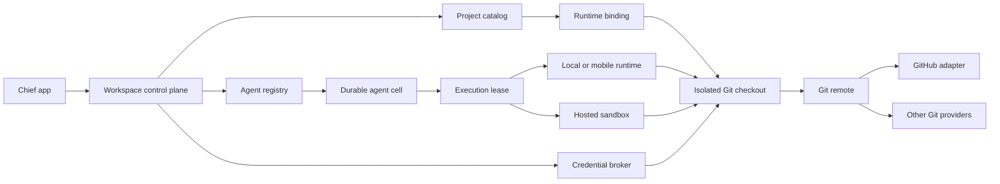

# Durable agents, Projects, and GitHub

> The runtime and deployment sections are superseded by
> `chief-relay-platform-prd.md`. Project and GitHub product requirements remain
> useful implementation detail.

Status: Draft for implementation  
Date: 16 August 2026  
Owner: Chief

This document defines the shared Projects model, the durable agent execution
model that consumes it, and the path from ordinary Git repositories to a
first-party GitHub integration.

It supersedes the Vercel-specific deployment portions of
`agent-runtime-platform-prd.md`. Eve remains useful as a portable agent
definition format. It is not the required hosting substrate.

## Summary

Chief should treat a project as a workspace-owned reference to a Git
repository. People and agents can materialize that repository on an authorized
runtime, but its local path is never the shared project identity.

Every agent has a durable identity and durable state. The agent may run on a
Mac, a mobile-compatible Celld runtime, or hosted infrastructure. When it needs
to change a project, Chief provisions an isolated checkout and a scoped Git
credential for that agent and project.

Generic Git is the foundation. GitHub becomes the first rich forge adapter
through a Chief GitHub App. GitLab, Bitbucket, self-hosted Git, and local
repositories continue to work without requiring provider-specific product
implementations.

## Goals

- Make Projects a first-class workspace concept alongside Agents.
- Support existing local and remote Git repositories without migration.
- Give agents isolated, reviewable branches and stable authorship.
- Keep project metadata shared while keeping runtime paths private.
- Let an agent continue across channels without losing its durable identity.
- Let the same agent move between local and hosted execution.
- Use short-lived, project-scoped credentials for hosted agents.
- Add a polished repository browser for branches, files, commits, contributors,
  and README content.
- Add a first-party GitHub connection for repository selection, pull requests,
  checks, comments, and reviews.
- Preserve a provider-neutral seam for other Git forges.

## Non-goals

- Rebuild GitHub, GitLab, or a general-purpose Git hosting service.
- Store the canonical Git object database in Chief application records.
- Give agents ambient access to every repository a user can access.
- Push directly to a protected or default branch by default.
- Implement equivalent forge APIs for every provider in the first release.
- Require a GitHub App before a user can add a project.
- Make an agent's full conversation history its permanent prompt context.

## Product principles

### Git remains Git

Chief uses ordinary repositories, remotes, branches, commits, and pull
requests. A repository added to Chief remains usable from the terminal and the
provider's own interface.

### Shared identity, private materialization

The workspace shares a `Project`. Each runtime owns a private
`ProjectRepositoryBinding` that maps that project to a checkout path. Paths,
SSH agents, and host credentials never enter the shared catalog.

### Agents are provisioned like coworkers

An agent receives:

- a durable identity;
- an isolated cell;
- explicit project assignments;
- a role and operation permissions;
- short-lived credentials for the projects it may use; and
- an isolated checkout for each active task.

Revoking an assignment revokes new credentials and stops new work. It does not
rewrite Git history.

### The remote is the project source of truth

For a portable project, the Git remote is authoritative. A checkout is a cache
and work surface. For a local-only project, the user is clearly told that the
project cannot move to another runtime until a remote is added.

### Provider features are adapters

Git transport is provider-neutral. Pull requests, checks, reviews, and provider
repository pickers live behind forge adapters. GitHub is the first rich
adapter, not the core domain model.

## User journeys

### Add a local repository

1. The user selects a folder containing `.git`.
2. Chief resolves the repository root and reads its remote, default branch,
   status, and display metadata.
3. Chief creates or reuses a workspace Project.
4. Chief creates a runtime binding for the selected folder.
5. If the repository has a remote, other authorized runtimes may materialize it.
6. If it has no remote, Chief marks it as local-only.

Chief must not move the folder, change its active branch, or rewrite its Git
configuration during this flow.

### Add a remote repository

1. The user enters an HTTPS or SSH Git URL.
2. Chief rejects URLs containing embedded credentials.
3. The current runtime clones the repository into a Chief-managed location.
4. Chief records the provider and canonical remote in the shared Project.
5. The runtime path remains private to that runtime.

### Add from GitHub

1. The user connects or installs the Chief GitHub App.
2. GitHub asks the user to choose the organizations and repositories Chief may
   access.
3. Chief lists only repositories in the selected installation.
4. The user chooses a repository.
5. Chief creates the Project and materializes it only when needed.

The repository picker is a convenience layer over the same Project creation
path used by ordinary Git URLs.

### Agent changes a project

1. The agent resolves a project by ID from its assigned project set.
2. The cell requests a checkout for a task.
3. The runtime creates a worktree or isolated clone on a branch named
   `chief/<agent>/<task>`.
4. The agent reads, edits, tests, and commits inside that checkout.
5. A push or pull request requires the corresponding project permission and
   policy decision.
6. Chief pushes with a short-lived project credential.
7. The forge adapter creates the pull request and reports checks and review
   state back to the project and relevant channel.
8. The checkout is released after the work is safely committed and published.

The attached human checkout never changes branch as a side effect of agent
work.

### Revoke an agent

1. Remove the agent's project assignment or disable the agent.
2. Credential Broker refuses new credentials immediately.
3. Active leases are cancelled or allowed to reach a safe checkpoint according
   to policy.
4. Existing remote branches and commits remain attributable and reviewable.
5. Runtime bindings and disposable checkouts are cleaned independently.

## Target architecture



## Domain model

### Project

Workspace-owned, shared metadata:

- `id`
- `organizationId`
- `name`
- `description`
- `providerId`
- `canonicalRemoteUrl`
- `repositoryWebUrl`
- `defaultBranch`
- `visibility`
- `createdAt`
- `updatedAt`

The Project never stores a local filesystem path or a reusable provider token.

### Project repository binding

Runtime-private materialization:

- `projectId`
- `organizationId`
- `runtimeId`
- `kind`: attached or materialized
- `repositoryPath`
- `lastFetchedAt`
- `createdAt`
- `updatedAt`

A binding is valid only on its owning runtime.

### Project assignment

The resource scope applied to a person, role, or agent:

- `subjectId`
- `projectId`
- `access`: read, write, or administer
- allowed operations
- optional branch policy
- created and revoked timestamps

This extends the existing permissions model. It is not a parallel ACL system.
Existing `projects.read` and `projects.write` permissions remain operation
gates; a project assignment narrows those permissions to named resources.

### Agent cell

Durable state associated with one agent identity:

- `agentId`
- `organizationId`
- agent definition and version
- durable inbox and event cursor
- compact durable memory
- scheduled alarms
- project assignments
- active execution leases
- artifact references
- audit cursor

Conversation messages stay in the workspace conversation store. The cell keeps
only the cursors, summaries, and task state required to continue work. Moving
between channels does not create a new employee or duplicate the cell.

### Execution lease

A bounded grant to run one piece of work:

- `leaseId`
- `agentId`
- `runtimeId`
- `taskId`
- `expiresAt`
- heartbeat and cancellation state
- project checkout grants
- capability set

Only one lease may own a task transition at a time. Leases make retries
idempotent and prevent two runtimes from continuing the same turn.

### Project checkout

An isolated work surface:

- `projectId`
- `runtimeId`
- `agentId`
- `taskId`
- `path`
- `strategy`: worktree or clone
- `branch`
- `baseRef`
- `status`
- last commit and publication state

Checkout paths never enter prompts or shared records sent to another tenant.

### Credential grant

A short-lived reference, not a stored secret:

- `grantId`
- `subjectId`
- `projectId`
- allowed provider operations
- expiry
- provider installation or credential reference
- audit metadata

The raw token is delivered only to the authorized runtime for the duration of
the operation.

## Durable cell runtime

### Contract

Chief defines a small durable-cell interface rather than binding the product to
one host:

- durable key-value or SQLite state;
- ordered event delivery;
- alarms or scheduled wake-ups;
- compare-and-swap task transitions;
- execution lease acquisition and renewal;
- artifact blob references;
- outbound tool and message calls; and
- runtime capability discovery.

The contract deliberately resembles Cloudflare Durable Objects so a hosted
implementation can use them directly and Celld can provide a compatible local
or mobile implementation.

### Hosted implementation

The first hosted implementation should use one Cloudflare Durable Object per
agent identity for coordination and durable state.

A Durable Object is not treated as a permanent POSIX machine. Git work happens
inside a disposable sandbox or attached execution environment obtained through
an execution lease. The remote repository is authoritative, while artifacts
and checkpoints live in durable storage.

This avoids storing a Git object database in Durable Object SQLite and avoids
assuming that one isolate remains alive forever.

### Local and mobile implementation

The desktop runtime can satisfy the same contract locally. Celld remains a
candidate for mobile and offline-compatible execution because it exposes a
Durable Object-shaped API and a local database.

Before Celld is used for multi-tenant hosted work, Chief must verify tenant
isolation, encryption, backup, process boundaries, and credential handling. A
local device runtime is lower risk because it serves one signed-in user and one
workspace context at a time.

### Eve

Eve remains the portable definition layer for:

- agent metadata;
- prompts and skills;
- tool declarations;
- file-based packaging; and
- import and export.

The cell owns execution lifecycle and durable coordination. Eve does not decide
where the cell runs, where project credentials live, or how Git is hosted.

## Git workflow and safety

### Branches

- Agent changes start on `chief/<agent>/<task>`.
- Direct writes to the default branch are disabled by default.
- A project may define allowed prefixes and protected refs.
- A branch is created from a verified commit ref.
- Two agents do not share a mutable checkout.

### Commits

- Every commit has stable Chief agent authorship.
- Commit metadata includes the durable agent ID and task ID.
- Commit messages are supplied by the model but normalized and length-limited.
- Signing can be added through the provider or a Chief signing service later.
- Existing human working trees and Git config are never overwritten.

### Pushes

- A push is an explicit tool operation.
- The operation validates project assignment, operation permission, ref policy,
  lease ownership, and credential expiry.
- The remote URL is resolved from Project metadata, never from model text.
- The credential is requested immediately before use and discarded afterward.
- Force push is disabled unless a project administrator explicitly enables it.

### Pull requests and reviews

The forge adapter owns pull request creation, comments, reviews, check status,
and provider links. The core workflow stores provider-neutral references and
status.

## GitHub integration

### Decision

Build a Chief GitHub App as the first rich forge adapter. Keep generic Git URLs
and local repositories fully supported.

A GitHub App gives Chief selected-repository installation, short-lived tokens,
clear organization ownership, and bot attribution without requiring personal
access tokens. GitHub recommends Apps for long-running integrations, and
installation tokens expire after one hour and can be narrowed to repositories
and permissions. See GitHub's documentation on
[choosing a GitHub App](https://docs.github.com/en/apps/creating-github-apps/about-creating-github-apps/deciding-when-to-build-a-github-app),
[installation tokens](https://docs.github.com/en/apps/creating-github-apps/authenticating-with-a-github-app/generating-an-installation-access-token-for-a-github-app),
and [Git authentication with an installation](https://docs.github.com/en/enterprise-cloud@latest/apps/creating-github-apps/authenticating-with-a-github-app/authenticating-as-a-github-app-installation).

### Minimum permissions

Start with:

- Metadata: read;
- Contents: read and write;
- Pull requests: read and write;
- Checks: read; and
- Commit statuses: read.

Issues may be added only when the product ships issue workflows. Administration,
members, secrets, workflows, and organization-wide write permissions are not
requested by default. GitHub's permission mapping is documented in
[Permissions required for GitHub Apps](https://docs.github.com/en/rest/authentication/permissions-required-for-github-apps).

### Token use

- Installation tokens authenticate autonomous Chief agent operations.
- User tokens are used only when an operation must be attributed to a human.
- Tokens are minted by Credential Broker for one installation and the minimum
  repository set.
- Tokens are never written to Git config, Project records, prompts, logs, or
  remote URLs.
- HTTPS Git uses an ephemeral askpass or credential helper scoped to the child
  process.

### Events

Subscribe only to events required to keep Chief current:

- installation and repository selection changes;
- pushes;
- pull request changes;
- pull request reviews;
- check runs and check suites; and
- commit statuses.

Webhook delivery is idempotent by GitHub delivery ID and tenant-scoped by the
resolved installation.

### Provider seam

```ts
interface ForgeAdapter {
  listRepositories(connectionId: string): Promise<ForgeRepository[]>;
  mintGitCredential(input: GitCredentialRequest): Promise<CredentialGrant>;
  createPullRequest(input: CreatePullRequestInput): Promise<ForgeChange>;
  getChecks(input: ForgeRef): Promise<ForgeCheck[]>;
  comment(input: ForgeCommentInput): Promise<ForgeComment>;
  review(input: ForgeReviewInput): Promise<ForgeReview>;
}
```

Git transport, tree browsing, worktrees, commits, and local repositories do not
depend on this interface.

## Projects interface

### Projects list

- Projects is a top-level sidebar destination.
- Cards show the project name, remote or local location, branch, working tree
  state, and latest commit.
- Chief scans a bounded set of common app icon and favicon paths. Raster icons
  are displayed when safe and small enough; otherwise Chief uses a Git folder
  mark.
- Project selection never changes the repository.
- The shared catalog is cached per workspace and never crosses workspace keys.

### Add project

- On this Mac: choose a folder containing `.git`.
- Git URL: clone an HTTPS or SSH remote without embedded credentials.
- GitHub: when the GitHub App is connected, choose from repositories in an
  allowed installation.

The dialog stays concise. Provider setup is invoked only when the user chooses
the provider path.

### Repository view

The landing view follows familiar Git hosting hierarchy without copying a
provider-specific shell:

1. project identity and location;
2. branch selector and repository state in one compact toolbar;
3. latest commit;
4. browsable file and directory table;
5. README for the selected directory;
6. contributors and recent commits; and
7. active agent branches.

Branches and directories are navigable. Files have a bounded read-only preview.
Binary and oversized files show a clear non-preview state. No repository UI uses
the tiny metadata font reserved for dense diagnostics.

### Future collaboration surface

After the GitHub adapter lands, project detail may add pull requests, checks,
reviews, and agent task links. These are tabs or secondary surfaces, not more
summary cards in the repository header.

## API and tool surface

### Read APIs

- `projects.list`
- `projects.inspect`
- `projects.browse({ projectId, ref, path })`
- `projects.commits`
- `projects.branches`
- `projects.checkouts.list`

All read operations require workspace capability and project membership. Refs
must resolve to commits and paths must remain relative to the repository.

### Agent write tools

- `projects.checkout.create`
- `projects.checkout.status`
- `projects.commit`
- `projects.checkout.release`
- `projects.push` (GitHub phase)
- `projects.pullRequest.create` (GitHub phase)
- `projects.pullRequest.comment` (GitHub phase)
- `projects.pullRequest.review` (GitHub phase)

Tool responses contain project IDs and provider links, not reusable credentials
or host filesystem paths.

## Security model

### Tenant isolation

- Every Project, assignment, cell, lease, checkout, and credential grant has an
  `organizationId`.
- Authorization verifies the signed-in subject, workspace membership,
  operation permission, project assignment, and runtime lease.
- Client-provided organization IDs are never sufficient authority.
- Client caches include the workspace ID in every key and are cleared or
  partitioned when switching workspaces.
- Hosted storage keys begin with a non-guessable tenant identifier.

### Local runtime

- The user explicitly chooses attached folders.
- Chief resolves and records the repository root, not an arbitrary subpath.
- Browser APIs never accept absolute repository paths from the model.
- Local paths are sent only to the owning desktop client.
- Agent checkouts live under Chief-owned directories with restrictive
  permissions.

### Credentials

- Provider secrets live in Credential Broker.
- Grants are short-lived and audience-bound.
- Agent prompts receive capability descriptions, not tokens.
- Git subprocesses have interactive prompting disabled.
- Logs redact authorization headers, query credentials, remote user info, and
  askpass payloads.

### Human access

Chief does not use one workspace member's local SSH agent to authorize another
member. A human can interact with a project only when their provider credential
or workspace policy allows it. A hosted agent uses its own project grant.

### Audit

Record:

- assignment and revocation;
- checkout creation and release;
- credential minting by reference, not token;
- commit, push, pull request, comment, and review operations;
- policy denials; and
- webhook delivery processing.

## Reliability

- Cell inbox events are idempotent.
- Task state transitions use compare-and-swap.
- Execution leases expire and can be recovered by another compatible runtime.
- Message delivery is an explicit durable tool result, not inferred from model
  completion.
- A committed but unpushed agent branch is surfaced as recoverable work.
- A pushed branch or pull request is the durable handoff point.
- Runtime restart never deletes a shared Project record.
- Project browsing is cached by workspace, project, ref, and path.
- Git failures preserve stderr for Activity while showing concise UI errors.

## Observability and testing

### Unit tests

- provider URL normalization and credential stripping;
- workspace and project boundary enforcement;
- ref and path validation;
- icon discovery limits;
- tree, file, README, contributor, and commit parsing;
- isolated worktree creation and commit authorship;
- assignment and branch policy decisions;
- credential grant expiry and revocation; and
- event and lease idempotency.

### Integration tests

- attach a fixture repository without changing its branch;
- clone and materialize the same project on a second runtime;
- run two agents in isolated branches;
- restart a runtime between commit and push;
- install the GitHub App for selected repositories;
- mint a repository-scoped installation token;
- push an agent branch and create a pull request;
- receive duplicate and out-of-order webhooks safely; and
- revoke the installation while work is active.

### Pressure tests

- concurrent channel messages routed to one durable agent cell;
- repeated runtime disconnect and lease recovery;
- many workspaces with identical project IDs or branch names;
- large repository trees and large README files;
- expired credentials during push; and
- repeated tool calls that must not duplicate messages, commits, or PRs.

Each live test creates an isolated workspace, uses the configured test model,
streams structured events to the test observer, and tears down the workspace,
checkouts, branches, and credentials afterward.

## Delivery plan

### Phase 1: Projects and local Git

- shared Project and private runtime binding model;
- local attach and remote clone;
- project list, icon discovery, and repository browser;
- isolated agent worktrees and commits;
- workspace and project boundary tests.

### Phase 2: Shared catalog and assignments

- move Project catalog records to the workspace control plane;
- keep runtime bindings local;
- extend existing permissions with project resource scopes;
- add explicit agent assignments and audit records;
- materialize portable projects on demand.

### Phase 3: Durable agent cells

- implement the portable cell contract;
- use one hosted durable coordinator per agent;
- add execution leases, durable inbox, alarms, and recovery;
- adapt the desktop runtime to the same contract;
- retain Celld as the mobile and offline-compatible adapter candidate.

### Phase 4: Chief GitHub App

- installation and selected-repository connection;
- repository picker in Add project;
- Credential Broker installation tokens;
- agent push and pull request tools;
- checks, comments, reviews, and webhook synchronization;
- revocation and branch policy tests.

### Phase 5: Additional forge adapters

Add richer GitLab, Bitbucket, or self-hosted adapters only when customer demand
justifies the provider-specific maintenance. Generic Git remains available in
every phase.

## Acceptance criteria

- A user can add an existing local repository without changing it.
- A remote-backed project appears to authorized workspace members and can be
  materialized on another runtime.
- A local-only project is clearly identified as non-portable.
- Project list and repository detail use discovered app icons when available.
- Users can change branches, browse directories and files, and read README
  content from Chief.
- Repository reads cannot escape the selected repository or workspace.
- Two agents can work on the same project without sharing a checkout or moving
  the human branch.
- Agent commits have stable identity and task provenance.
- No push occurs without project write access and branch policy approval.
- Revoking an agent or GitHub installation prevents new credentials.
- A runtime crash can resume from durable task state without duplicating the
  agent's user-visible message or Git operation.
- GitHub repositories can be selected through the App and agent work can land
  as reviewable pull requests.

## Open decisions

- Hosted sandbox provider and filesystem persistence duration.
- Whether agent commits are cryptographically signed in the first GitHub phase.
- Exact approval policy for first push and first pull request per project.
- Whether local mobile execution ships before or after the hosted cell.
- Retention period for released checkouts and unpublished branches.

These decisions do not change the Project identity, assignment, credential, or
forge adapter boundaries defined above.
