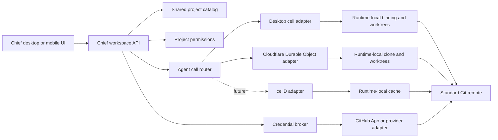

# Projects and Durable Agents

> The runtime and deployment sections are superseded by
> `chief-relay-platform-prd.md`. Project interface requirements remain useful
> implementation detail.

Status: Draft for implementation  
Owner: Chief  
Target branch: `feat/projects`

## Summary

Projects make Git repositories first-class workspace resources. People and agents can browse the same repository, create isolated branches, review changes, and publish work through the repository's existing host.

Durable agents extend that model beyond one desktop session. Each agent runs through a durable cell interface with a serialized inbox, recoverable state, scoped project access, and an isolated checkout. The agent specification remains portable. Local desktop, hosted Cloudflare Durable Objects, and a future mobile-capable cell runtime are deployment adapters behind the same contract.

This document defines the product model, architecture, security boundaries, interface contracts, delivery sequence, and acceptance criteria.

## Implementation agent orientation

This section is mandatory. An implementation agent must read the relevant references before changing code. The reference repositories are read-only inputs: all product changes belong in Chief unless a task explicitly says otherwise.

### Repository locations on the development machine

| Repository | Path | Purpose |
| --- | --- | --- |
| Chief | `/Users/danielsims/Documents/Development/chief` | Product being implemented and source of truth for its architecture and conventions. |
| Buzz | `/Users/danielsims/Documents/Development/buzz` | Reference for shared workspace projects, Git hosting, repository browsing, pull requests, reviews, agent workflows, and Git policy. |
| iOS Durable Agent | `/Users/danielsims/Documents/Development/ios-durable-agent` | Reference for cellD-compatible Durable Object execution, per-cell storage, restart recovery, an isolated computer, offline Git, and mobile constraints. |

Do not search vendored dependencies, build output, `.cache`, `node_modules`, or generated files for architecture. Read each repository's applicable `AGENTS.md` before inspecting or changing anything in that repository.

### Read Chief first

Start with the current implementation rather than assuming this document describes code that does not yet exist:

- `AGENTS.md`
- `apps/desktop/src/components/projects/`
- `apps/desktop/src/lib/runtime-projects.ts`
- `apps/desktop/src/pages/projects.tsx`
- `packages/agent-runtime/src/project-types.ts`
- `packages/agent-runtime/src/projects/`
- `packages/agent-runtime/src/db/project-schema.ts`
- `packages/agent-runtime/test/project-git-service.test.ts`

Identify which delivery package owns the requested change and preserve the existing workspace-scoped service, cache, message, and authorization boundaries. Do not introduce a parallel Projects API or a second diff renderer.

### Buzz reading map

Read Buzz's root `AGENTS.md` first. Then read the smallest relevant group below in full.

#### Product and repository UI

- `desktop/src/app/routes/projects.$projectId.tsx`
- `desktop/src/features/projects/ui/ProjectDetailScreen.tsx`
- `desktop/src/features/projects/ui/ProjectRepositoryPanel.tsx`
- `desktop/src/features/projects/ui/ProjectRepositorySource.tsx`
- `desktop/src/features/projects/ui/ProjectReadmePanel.tsx`
- `desktop/src/features/projects/ui/ProjectCommitDetailPanel.tsx`
- `desktop/src/features/projects/useProjectCommitDiff.ts`
- `desktop/src/shared/api/projectGit.ts`
- `desktop/src/shared/api/projectGitTypes.ts`

Use these to understand route-addressable project state, repository snapshots, ref selection, file history, commit detail, diff data, contributor identity, and how the UI separates fetching from presentation.

#### Pull requests and reviews

- `desktop/src/features/projects/ui/ProjectPullRequestsPanel.tsx`
- `desktop/src/features/projects/ui/CreatePullRequestDialog.tsx`
- `desktop/src/features/projects/ui/ProjectPullRequestFilesChangedPanel.tsx`
- `desktop/src/features/projects/ui/ProjectPullRequestInlineComments.tsx`
- `desktop/src/features/projects/ui/PullRequestReviewCard.tsx`
- `desktop/src/features/projects/ui/PullRequestReviewersRow.tsx`
- `desktop/src/features/projects/ui/MergePullRequestButton.tsx`
- `desktop/src/features/projects/projectPullRequests.mjs`
- `desktop/src/features/projects/pullRequestMutations.ts`
- `desktop/src/features/projects/pullRequestReviews.ts`
- `desktop/src/features/projects/projectPullRequestConflictRecovery.ts`
- the adjacent `*.test.mjs` files

Use these to learn the interaction and failure cases for base/compare selection, optimistic mutations, review state, inline comments, merge readiness, conflict recovery, and durable provider events. Chief should reuse the underlying product lessons, not Buzz-specific styling or event schemas.

#### Shared project and Git architecture

- `desktop/src/features/projects/hooks.ts`
- `desktop/src/features/projects/useCreateProject.ts`
- `desktop/src/features/projects/useProjectsRepoSnapshots.ts`
- `desktop/src/features/projects/lib/projectLocalRepos.ts`
- `desktop/src/features/projects/lib/projectCloneUrl.ts`
- `desktop/src/features/projects/lib/projectAgentConversation.ts`
- `crates/buzz-db/src/git_repo.rs`
- `crates/buzz-relay/src/api/git/manifest.rs`
- `crates/buzz-relay/src/api/git/manifest_event.rs`
- `crates/buzz-relay/src/api/git/hydrate.rs`
- `crates/buzz-relay/src/api/git/policy.rs`
- `crates/buzz-relay/src/api/git/transport.rs`
- `crates/buzz-cli/src/commands/repos.rs`
- `crates/buzz-cli/src/commands/pr.rs`
- `crates/buzz-test-client/tests/e2e_git.rs`

Use these to understand how Buzz separates shared project identity from local repository state, hydrates repositories, applies Git policy, exposes agent-facing commands, and verifies Git behavior end to end.

#### What Chief should and should not inherit from Buzz

Chief should inherit the following lessons:

- A project is shared workspace context, while a checkout path belongs to one runtime.
- Commit, branch, pull request, and review state should be addressable and testable independently of the page rendering it.
- Agent work needs explicit repository scope and an isolated branch or checkout.
- Provider mutations need typed conflict handling and optimistic UI recovery.
- Git authorization and policy belong in trusted services, not prompts or React components.
- Project conversations should reference durable project and provider identifiers.

Chief must not blindly copy:

- Buzz's Nostr event kinds, relay-hosted Git transport, Nostr keys, or credential helpers.
- Buzz's repository hosting assumption. Chief's initial portability boundary is an existing Git remote.
- Buzz's workspace or channel authorization rules without mapping them to Chief's organization, project grant, agent capability, and provider permission model.
- Buzz UI wholesale. Use it to understand behavior and edge cases while keeping Chief's visual language.

### iOS Durable Agent reading map

Start with:

- `README.md`
- `docs/computer-runtime.md`
- `docs/inference-providers.md`

Then read the runtime boundaries:

- `ios/Packages/CelldKit/Sources/CelldKit/CelldRuntime.swift`
- `ios/DurableAgent/AgentRuntime.swift`
- `ios/DurableAgent/RuntimeComposition.swift`
- `ios/DurableAgent/agent.js`
- `rust/worker-core/src/lib.rs`
- `rust/worker-core/src/storage.rs`
- `rust/worker-core/src/computer.rs`
- `rust/worker-core/src/codemode.rs`

For durability, steering, and tool execution, read:

- `ios/Packages/ToolCallKit/Sources/ToolCallKit/AgentLoop.swift`
- `ios/Packages/ToolCallKit/Sources/ToolCallKit/AgentContextCheckpoint.swift`
- `ios/DurableAgent/AgentContextCheckpointStore.swift`
- `ios/DurableAgent/AgentSteeringStore.swift`
- `ios/DurableAgent/AgentActivityCoordinator.swift`
- `ios/Packages/ComputerKit/Sources/ComputerKit/ComputerRuntime.swift`
- `ios/Packages/CelldKit/Sources/CelldKit/CelldComputerBackend.swift`
- the corresponding tests under `ios/Packages/*/Tests` and `rust/worker-core/tests`

Use these to understand:

- A Worker-compatible Durable Object class as the portable agent entry point.
- Fresh isolate execution over durable per-cell state rather than a permanently alive process.
- One SQLite-backed storage scope per cell.
- A workspace that is hydrated, executed, and committed as an atomic snapshot.
- A backend-neutral computer contract that can select phone-local or hosted execution independently from agent state placement.
- Explicit steering, checkpoint, resume, browser, and tool boundaries.
- Offline Git as local workspace state, with clone, fetch, pull, and push treated as separate authenticated transport capabilities.

Do not assume the proof of concept is production-ready. In particular, do not copy its cell identifier scheme, storage limits, conversation-to-cell mapping, credential handling, or tenant boundary without completing the security work in this PRD. Chief's intended unit is an agent deployment in an organization, not automatically one cell per chat conversation.

### Required implementation note

Before editing code, the implementing agent must state:

1. The delivery package and acceptance criterion it is implementing.
2. The Chief files it will extend rather than duplicate.
3. The Buzz and iOS Durable Agent files it read for this task.
4. Which reference behavior it will reuse, adapt, or deliberately reject.
5. The tenant, credential, filesystem, retry, and idempotency invariants affected.
6. The focused tests that will prove the change.

This note can live in the task commentary or pull request description. It does not require another permanent planning document.

## Product principles

1. **Git remains Git.** Chief uses ordinary repositories, branches, commits, remotes, and pull requests. Repositories must remain usable through existing terminals, editors, hosting providers, and CI systems.
2. **Projects belong to workspaces.** A project is shared workspace context, not an attachment to one agent or one device.
3. **Work is isolated by default.** Agents never edit a person's active checkout. Each agent works in a Chief-owned worktree or clone on a dedicated branch.
4. **Access is explicit.** Workspace membership does not automatically grant repository write access. Effective permission is the intersection of Chief permissions, provider permissions, and branch protection.
5. **Credentials stay outside model context.** Agents request capabilities. A trusted host brokers credentials and performs authorized operations.
6. **Agents are durable, specifications are portable.** Eve can continue to define agent files, tools, prompts, and skills. Runtime state and deployment are handled by a separate cell contract.
7. **Local and hosted are modes of one product.** Local projects and local agents remain useful. Portable projects and hosted agents add availability without changing the core mental model.
8. **Recovery is part of correctness.** A restart, timeout, or transient network failure must not lose accepted work, duplicate messages, or leave invisible runs.
9. **Provider features are progressive enhancement.** Generic Git works without a dedicated integration. GitHub, GitLab, and Bitbucket adapters add repository selection, pull requests, checks, and richer identity.
10. **No decorative complexity.** The first release uses a clear repository browser and commit history grouped by date. A commit graph is not required.

## Goals

- Add local or remote Git repositories to a workspace as projects.
- Browse branches, directories, files, README content, contributors, and scoped commit history.
- Preserve repository image rendering and code syntax highlighting safely.
- Let agents create isolated checkouts, inspect changes, commit, and release work.
- Add project-level permissions and auditable operations.
- Support generic Git remotes and a first-class GitHub integration through one provider seam.
- Let deployed agents materialize portable projects without depending on a person's Mac.
- Give every agent a durable, serialized execution environment that can recover after interruption.
- Provide deterministic tests for Git operations, tenant isolation, permissions, provider behavior, and durable execution.

## Non-goals

- Reimplementing Git storage, merge algorithms, hosting, or code review.
- Building a Chief-specific source control protocol.
- Replacing GitHub, GitLab, Bitbucket, local Git, terminals, or editors.
- Granting every workspace member or agent blanket repository access.
- Writing directly to protected or default branches by default.
- Running production multi-tenant workloads on cellD before its isolation model is independently validated.
- Running the complete hosted agent environment on iOS in the first release.
- Building a commit graph, full IDE, visual merge tool, or provider-specific UI for every forge.

## Terminology

| Term | Meaning |
| --- | --- |
| Project | Workspace-owned metadata that identifies one Git repository. |
| Portable project | A project with a remote that another authorized runtime can materialize. |
| Local-only project | A project attached to a local repository without a usable remote. |
| Binding | One runtime's local path for a project. Paths are never shared across runtimes. |
| Checkout | An isolated worktree or clone owned by one agent on one runtime. |
| Provider | GitHub, GitLab, Bitbucket, or a generic Git transport. |
| Provider connection | A user or workspace authorization to a hosted provider. |
| Cell | A runtime adapter that supplies durable state, ordered events, alarms, and isolated execution. |
| Agent deployment | One agent specification bound to a cell in a workspace. |
| Principal | A person, agent, service account, or app installation performing an operation. |

## Locked decisions

### Projects are first-class workspace resources

Projects sit alongside Agents in the main navigation. Agents consume projects, but projects are not nested under agents.

### Remote Git is the portability boundary

The shared database stores project identity and remote metadata. It does not store repository contents. A remote repository remains the portable source of truth. Runtime-local bindings store local paths.

A local-only project is valid, but it is available only on the runtime that attached it. The UI must label this state. A deployed agent cannot use it until a remote is added or an explicit secure transfer feature is introduced.

### Agents use isolated branches

Each agent task that can modify a repository receives a dedicated checkout. The default branch naming convention is:

```text
chief/<agent-slug>/<checkout-id>
```

The branch may be named explicitly when the caller has permission and the name passes Git validation. Agents do not modify a user's attached working tree.

### Git identity and authentication are separate

Commit authorship identifies the agent. Authentication identifies the credential used to publish it.

Initial local author format:

```text
Engineer via Chief <engineer@agents.chief.local>
```

A hosted integration may use a provider-recognized bot identity while preserving agent attribution in commit trailers and audit records. Chief must not impersonate a human contributor. Signed bot commits are a later enhancement.

### GitHub App is the first rich provider integration

Generic Git remains supported. A GitHub App provides the best first-class GitHub experience because repository selection, installation scope, bot attribution, short-lived tokens, pull requests, and checks can be managed without storing a person's long-lived personal token.

GitLab and Bitbucket must fit the same provider contract later. They do not require parallel UI implementations in the first release.

### Eve and cells solve different problems

Eve remains the agent specification and packaging format where it is useful. It describes agents, prompts, tools, skills, and files. It is not the source of truth for durable delivery, tenant routing, repository permissions, or runtime recovery.

The cell contract supplies those runtime guarantees. Cloudflare Durable Objects are the first hosted implementation. The desktop runtime is the local implementation. cellD remains a future local and mobile implementation after its security and tenant isolation properties are validated.

## User experience

### Projects page

The Projects page contains:

- A concise title and description.
- An Add project action.
- A list of projects using repository or product identity when available.
- Provider, portability, branch, and working-tree state without decorative status indicators.
- Clear unavailable or local-only states.

Project identity preference order:

1. Product favicon or app icon found in well-known repository locations.
2. Provider repository or organization avatar when authorized.
3. Generated repository initials.

Project icon discovery must be bounded. It may inspect common manifest and asset paths, but it must not recursively scan an unbounded repository on every render. Results are cached by project and revision.

### Add project

The first release presents two stable modes in one compact dialog:

1. **On this Mac**: choose a folder that contains a Git repository.
2. **Git URL**: enter a clone URL supported by the installed Git credential flow.

When a GitHub provider connection is available, the Git URL mode may also show a searchable repository picker. Selecting a repository fills the canonical remote and delegates materialization to the same backend operation. Provider selection is an enhancement of the same flow, not a third project type.

The dialog does not ask for redundant fields. Name and default branch are derived from Git and can be edited later.

### Repository browser

The project detail view follows familiar Git hosting conventions:

- Branch picker with truncation and a permanently visible chevron.
- Branch count and commit history entry points.
- Current path breadcrumb.
- Latest commit summary for the current tree or file.
- Directory and file table with last relevant commit.
- Rendered README below the root file table.
- Syntax-highlighted source view with line numbers.
- Contributor list with resolved avatars.
- Agent branches and checkout state.
- Commit history grouped by Today, Yesterday, then calendar date.

Repository images must support:

- Relative paths resolved against the selected ref and README path.
- Root-relative repository paths.
- Data URLs produced by the trusted repository backend.
- Approved remote HTTPS images subject to existing network and content security policy.
- Safe placeholders that never expose a local filesystem path to rendered Markdown.

History on a directory or file is scoped to that path. Repository-root history covers the whole repository.

### Commit detail

Every commit row is navigable. Commit detail uses a provider-neutral Git view with:

- Commit hash, subject, author avatar, author name, and relative time.
- Parent commit links.
- File, addition, and deletion counts.
- One vertically stacked diff card per changed file.
- Syntax highlighting and old/new line numbers.
- Renamed, added, deleted, binary, and oversized file states.
- A Browse files action that opens the repository at that commit.
- Path-scoped entry when opened from a file's history, while still allowing the complete commit to be reviewed.

Diff data comes from local Git or the materialized runtime binding. The first release is read-only. Inline comments and review annotations are added through the pull request layer so they retain provider identity and durable delivery.

### Pull request workspace

Pull requests reuse commit and diff primitives rather than introducing a separate code renderer. The provider adapter supplies metadata and mutations. The view includes:

- Title, number, status, author, base branch, and compare branch.
- Conversation, commits, checks, and files changed tabs.
- Reviewers and review state.
- Deployments and checks when the provider exposes them.
- A stacked files-changed view using the same diff component as commit detail.
- Structured comments anchored to the pull request or a diff line.
- Create, update, approve, request changes, merge, close, and delete-branch actions gated by provider capability and Chief permission.

The conversation tab is a durable event timeline rather than a copy of a provider page. It combines the pull request description, comments, commits, reviews, checks, deployments, merge events, and branch lifecycle into one ordered view. Events retain the provider identity that authored them. The comment composer supports Markdown and attachments when the provider capability permits them. After merge, the timeline shows the resulting commit and offers only valid follow-up actions such as viewing the deployment, reverting, or deleting the source branch.

Creating a pull request begins with a branch comparison. The user selects base and compare refs, sees whether the refs are mergeable, and reviews the commits, files, additions, and deletions before entering a title and description. Reversing the comparison swaps both refs without rebuilding the page. Chief may propose the title and description, but publication remains an explicit operation. Generic Git projects keep branch comparison and diff review even when pull requests are unavailable.

The layout may borrow familiar interaction patterns from GitHub and BetterHub, but Chief keeps its own visual system and project mental model. Provider-specific sidebars, labels, milestones, or project boards appear only when they add genuine workflow value; they are not reproduced for parity.

### Review and publish flow

An agent's branch is visible as soon as a checkout exists. The interface shows:

- Agent identity.
- Base ref.
- Branch.
- Changed files.
- Last activity.
- Commit status.
- Publish or pull request state when supported.

People can inspect the diff before publication. Publishing requires explicit permission. Protected branch rules remain authoritative.

## System architecture



### State ownership

| State | Owner | Portable | Notes |
| --- | --- | --- | --- |
| Project metadata | Shared workspace database | Yes | Scoped by organization and project. |
| Project permissions | Shared workspace database | Yes | Separate from provider authorization. |
| Provider connection metadata | Shared control plane | Yes | Stores installation references, not raw secrets. |
| Provider credentials | Secret broker | No direct model access | Prefer short-lived tokens. |
| Repository contents | Git remote | Yes when remote exists | Standard Git is authoritative. |
| Local binding path | Runtime-local database | No | Scoped by organization, runtime, and project. |
| Agent checkout path | Runtime-local database | No | Scoped by organization, runtime, project, and agent. |
| Agent durable state | Owning cell | Yes through cell implementation | Small state and event cursors, not full Git history. |
| Agent messages and tool events | Workspace database and durable outbox | Yes | Idempotent and auditable. |

## Project data model

### Existing records to preserve

#### `project`

- `organizationId`
- `id`
- `name`
- `description`
- `repositoryKind`: `attached | cloned`
- `providerId`: `local | generic-git | github | gitlab | bitbucket`
- `canonicalRemoteUrl`
- `repositoryWebUrl`
- `defaultBranch`
- timestamps

The primary key and remote uniqueness constraint remain workspace-scoped.

#### `binding`

- `organizationId`
- `projectId`
- `runtimeId`
- `kind`: `attached | materialized`
- `repositoryPath`
- timestamps

The unique binding is scoped by organization, runtime, and project. A path must never be reused across organizations on the same runtime.

#### `checkout`

- `organizationId`
- `projectId`
- `runtimeId`
- `agentId`
- `agentIdentity`
- optional `sessionId`
- `strategy`: `worktree | clone`
- `path`
- `branch`
- `baseRef`
- `status`: `active | released`
- timestamps

### Required additions

#### `project_grant`

| Field | Purpose |
| --- | --- |
| `organizationId` | Tenant boundary. |
| `projectId` | Project boundary. |
| `principalType` | `user | agent | role`. |
| `principalId` | Workspace user, agent, or role ID. |
| `capability` | `view | checkout | commit | publish | review | administer`. |
| `constraintJson` | Optional branch, environment, or expiry constraints. |
| timestamps | Audit and expiry support. |

#### `provider_connection`

| Field | Purpose |
| --- | --- |
| `organizationId` | Tenant boundary. |
| `id` | Opaque connection ID. |
| `providerId` | Initially `github`. |
| `installationId` | Provider-side installation reference. |
| `accountLabel` | Display-only organization or account name. |
| `secretReference` | Reference into the credential broker. |
| `status` | `active | expired | revoked | error`. |
| timestamps | Lifecycle tracking. |

#### `project_provider_link`

Links one project to one provider connection and repository identifier. This record holds provider repository IDs and installation scope, never an access token.

#### `project_operation`

Records checkout creation, commit, publish, pull request, release, and failures with principal, project, agent, branch, correlation ID, and sanitized outcome.

#### `agent_deployment`

Links an agent specification to one cell route, deployment mode, version, status, and durable state namespace.

## Provider adapter contract

Git transport remains separate from hosted forge behavior.

```ts
interface ProjectProviderAdapter {
  id: "github" | "gitlab" | "bitbucket";
  resolveRemote(input: string): ProviderRepositoryIdentity;
  listRepositories(connectionId: string, query?: string): Promise<Repository[]>;
  getRepository(connectionId: string, repositoryId: string): Promise<Repository>;
  createGitCredential(input: CredentialRequest): Promise<ShortLivedCredential>;
  createPullRequest(input: PullRequestInput): Promise<PullRequest>;
  updatePullRequest(input: PullRequestUpdate): Promise<PullRequest>;
  getChecks(input: RefInput): Promise<CheckSummary[]>;
}
```

Provider capabilities are declared so generic Git can omit unsupported operations without conditional logic throughout the UI.

```ts
interface ProjectProviderCapabilities {
  repositoryPicker: boolean;
  shortLivedCredentials: boolean;
  pullRequests: boolean;
  checks: boolean;
  reviews: boolean;
}
```

## Git operation lifecycle

### Add and materialize

1. Resolve or validate the Git repository.
2. Create or reuse the workspace project by canonical remote.
3. Create a runtime binding.
4. Read default branch and provider metadata.
5. Emit a workspace-scoped project change event.

When a project is opened on a new runtime, `ensureBinding` materializes it only when it has a usable remote and the caller has access. Local-only projects return a typed unavailable state instead of an ambiguous Git error.

### Create agent checkout

1. Authorize the agent for `checkout` on the project and base ref.
2. Resolve the runtime binding.
3. Validate the base commit and branch name.
4. Create a Chief-owned worktree or clone.
5. Persist checkout ownership before returning the path.
6. Expose only that checkout path to the agent execution environment.

### Commit

1. Confirm checkout ownership and active state.
2. Inspect status.
3. Stage within the checkout only.
4. Create a normalized commit subject and agent attribution trailer.
5. Persist the resulting hash and audit operation.
6. Refresh project and conversation UI through one project-change event.

### Publish and pull request

1. Authorize `publish` for the project and target branch.
2. Request a short-lived provider credential through the trusted host.
3. Push the agent branch with an explicit refspec.
4. Create or update a pull request when supported.
5. Save provider IDs and links.
6. Post a structured project result into the originating conversation.
7. Observe checks and surface failures without automatically bypassing protection.

Direct pushes to the default branch are disabled unless an administrator explicitly enables them for a constrained automation.

### Release

A clean checkout may be released after its useful commits are preserved. Release removes the worktree, retains the branch, updates the checkout state, and records the operation. Dirty checkouts require commit or an explicit discard operation with confirmation.

## Permissions and security

### Effective authorization

Every operation evaluates all of the following:

1. The principal belongs to the workspace.
2. The principal has the required Chief project capability.
3. The agent deployment is allowed to use that project.
4. The provider connection can access that repository.
5. The provider and repository permit the Git operation.
6. Branch protection permits the requested target.

The most restrictive result wins.

### Credential rules

- Prefer GitHub App installation tokens with short expiry.
- Store provider secrets in a credential broker or platform secret store.
- Persist only opaque secret references in application tables.
- Never include tokens in prompts, tool results, logs, database errors, URLs, or Git remote values returned to the model.
- Redact credentials from subprocess output before persistence.
- Supply credentials only for the duration and repository scope of one trusted operation.
- Revoke or expire credentials when an installation is removed.

### Filesystem isolation

- Normalize every repository and checkout path before use.
- Reject traversal outside the runtime's workspace root.
- Do not follow repository symlinks when resolving tool-access boundaries without an explicit safe resolver.
- Run agent commands with the checkout as the only writable project path.
- Keep runtime roots separated by organization, project, and checkout IDs.
- Treat Git hooks and repository configuration as untrusted input. Do not execute arbitrary hooks during server-side operations.

### Tenant isolation

- Every shared record includes `organizationId` in its key or mandatory query predicate.
- Every cache key begins with organization and project IDs.
- A workspace switch clears or changes the active cache namespace before rendering data.
- Runtime bindings may not be resolved by project ID alone.
- Durable cell IDs are opaque and include an organization routing boundary.
- Tests must attempt cross-workspace reads and writes using valid IDs from another tenant.

### Audit

Audit records are immutable application events containing sanitized metadata:

- actor and agent identity
- workspace and project
- checkout and branch
- operation and result
- commit or pull request identifier
- correlation and idempotency keys
- timestamp and runtime deployment

Audit records never contain repository file contents or credentials.

## Durable agent model

### Cell contract

```ts
interface AgentCell {
  id: string;
  enqueue(event: AgentEvent): Promise<EnqueueResult>;
  getStatus(): Promise<AgentCellStatus>;
  readState<T>(key: string): Promise<T | undefined>;
  writeState<T>(key: string, value: T): Promise<void>;
  schedule(input: AgentAlarm): Promise<void>;
  cancelAlarm(id: string): Promise<void>;
  acquireProject(input: ProjectLeaseRequest): Promise<ProjectLease>;
  releaseProject(leaseId: string): Promise<void>;
}
```

The application depends on this contract, not on Cloudflare, cellD, or desktop-specific APIs.

### Implementations

#### Desktop cell

- Runs on the user's selected Mac runtime.
- Uses the existing local runtime database and process supervisor.
- Persists event cursors, leases, and outbox state across app restarts.
- Uses local bindings and Git worktrees.
- Clearly reports when the device is offline or unavailable.

#### Cloudflare Durable Object cell

- First hosted implementation.
- One logical object per agent deployment and workspace.
- Serializes events for an agent.
- Uses Durable Object storage for small state, cursors, alarms, leases, and outbox records.
- Delegates filesystem and Git execution to an isolated worker or sandbox service through a narrow project lease API.
- Does not place full repositories inside Durable Object storage.
- Uses provider credentials through the credential broker.

#### cellD cell

- Future local or mobile-capable implementation.
- Must pass the same cell contract and conformance suite.
- Requires a documented production isolation model, encrypted storage, upgrade behavior, background execution limits, and multi-tenant review before hosted use.
- May enable offline or on-device tasks later. The first mobile Chief client talks to hosted cells rather than requiring the full agent runtime on the phone.

### Agent execution state

Each deployment owns:

- serialized inbox cursor
- current run and lease
- bounded working memory references
- schedules and heartbeat state
- project lease references
- transactional outbox
- last progress event
- retry and terminal state

Conversation history and project contents remain in their authoritative stores. The cell keeps references and bounded summaries rather than accumulating an unbounded prompt.

### Reliable message and tool delivery

Messages, reactions, project updates, and action items are explicit tool operations. A durable run uses a transactional outbox:

1. The agent requests a side effect with an idempotency key.
2. The cell commits the outbox record before acknowledging the tool result.
3. A dispatcher performs the side effect.
4. The result is written once and linked to the originating run.
5. Retries reuse the same idempotency key.

The UI only reports a no-output timeout when the active run has neither progress nor a delivered useful output. A delivered reply cannot later be replaced by a synthetic timeout error.

### Run recovery

- Runs acquire renewable leases.
- Tool output and progress renew the lease.
- A lost lease moves the run to recoverable state.
- Recovery resumes from durable tool and outbox boundaries, not from arbitrary in-memory reasoning.
- Non-idempotent tools require a recorded prepare and result protocol.
- Operators can inspect one correlation timeline across model, tools, messages, project operations, and retries.

## Agent tool surface

### Existing tools

| Tool | Capability | Behavior |
| --- | --- | --- |
| `projects.list` | `projects.read` | Lists workspace projects and runtime availability. |
| `projects.inspect` | `projects.read` | Reads branches, status, commits, and checkouts. |
| `projects.createCheckout` | `projects.write` | Creates an isolated agent checkout. |
| `projects.checkoutStatus` | `projects.read` | Reads status and diff summary. |
| `projects.commit` | `projects.write` | Commits only inside the caller's checkout. |
| `projects.releaseCheckout` | `projects.write` | Releases a clean checkout. |

### Required tools

| Tool | Capability | Behavior |
| --- | --- | --- |
| `projects.browse` | `projects.read` | Reads a committed tree or file at a ref. |
| `projects.diff` | `projects.read` | Returns structured and bounded diff data. |
| `projects.publish` | `projects.publish` | Pushes one owned branch through the credential broker. |
| `projects.pullRequest.create` | `projects.publish` | Creates a provider pull request. |
| `projects.pullRequest.status` | `projects.read` | Reads checks and review state. |
| `projects.comment` | `projects.review` | Adds an attributed provider comment when authorized. |
| `projects.discardCheckout` | `projects.write` plus confirmation | Deletes uncommitted checkout state explicitly. |

Tool descriptions must teach the model to inspect first, use an isolated checkout, make focused commits, report results in the originating conversation, and avoid publishing without permission.

## GitHub integration

### Installation

Use a GitHub App with repository selection. Request the smallest practical permission set:

- Metadata: read
- Contents: read and write only for selected repositories
- Pull requests: read and write
- Checks: read
- Issues: optional, separate capability

Administration, actions management, secrets, deployments, and organization membership are not required for the initial project workflow.

### Repository picker

When connected, Add project can query repositories visible to the app installation. Search and pagination occur server-side. The returned data includes provider repository ID, owner/name, default branch, privacy, avatar, and clone metadata. Selecting a repository creates the project and materializes it through the standard project service.

### Agent attribution

GitHub operations are performed by the app installation. Chief preserves the logical agent identity in:

- commit author and trailers
- pull request body metadata
- provider comments
- application audit records

Human attribution appears separately when a person approves or publishes an operation.

### Failure behavior

Expired or revoked installations move the provider connection to a typed state. Existing local repository data remains browseable. Publish actions explain that reconnection is required and provide one recovery action. They do not silently fall back to unrelated personal credentials.

## Performance and caching

- Cache repository browser snapshots by organization, project, ref, path, and resolved commit hash.
- Reuse loaded project state during navigation within one workspace.
- Invalidate on project change events, selected ref changes, or explicit refresh.
- Never share caches across organizations, even when remote URLs match.
- Bound Git command output, file size, README size, diff size, history count, and execution time.
- Load older history incrementally.
- Resolve avatars and repository icons asynchronously and cache successful results.

## Observability

Every run and project operation shares a correlation ID. The development harness exposes:

- ordered agent events
- model start and finish
- tool start, progress, result, and retry
- outbox prepare and delivery
- message insertion
- project checkout, commit, publish, and release
- lease renewal and recovery
- sanitized error details

The UI Activity panel consumes the same event model as tests. Tests should be visible while running through structured console output or an optional local observability view.

## Testing strategy

### Unit tests

- Remote URL parsing and credential stripping.
- Provider resolution and capability selection.
- Branch and path validation.
- Commit history grouping and path scoping.
- README image resolution and Markdown safety.
- Project permission intersection.
- Cache key tenant scoping.
- Outbox idempotency and retry transitions.
- Run lease and timeout state machines.

### Git integration tests

Use temporary repositories and bare remotes to test:

- attach and clone
- binding reuse on one runtime
- materialization on a second runtime
- concurrent agent worktrees
- ownership enforcement
- commits and attribution
- publish with explicit refspec
- release and dirty-checkout refusal
- branch divergence and conflict reporting
- file and directory history scoping
- repository with spaces, Unicode, submodules, symlinks, and large files

### Security tests

- Cross-workspace access with valid foreign project and checkout IDs.
- Cross-agent checkout access.
- Provider connection from another organization.
- Path traversal and symlink escape.
- Git remote with embedded credentials.
- Credential redaction in logs and errors.
- Malicious README URLs and data URLs.
- Untrusted Git hooks.
- Default branch publish without capability.

### Provider contract tests

Every rich provider adapter passes one contract suite for repository discovery, credential acquisition, publish, pull request creation, check retrieval, revocation, pagination, and rate-limit behavior.

Use a GitHub App sandbox installation for live tests. Live tests are opt-in, rate-limited, and never run against production repositories.

### Durable cell conformance tests

Every cell adapter must pass the same suite:

- ordered delivery
- duplicate event rejection
- restart during a model run
- restart before and after a tool side effect
- outbox recovery
- alarm delivery
- lease expiry
- project lease cleanup
- workspace isolation
- bounded state and backpressure

### End-to-end reliability tests

Create an ephemeral workspace with seeded conversations and a temporary Git remote. Run a real agent only through the approved test model configuration. Assert observable outcomes instead of reasoning text:

- agent acknowledges a tagged request
- checkout is created
- requested file changes exist
- commit is created on the owned branch
- response is inserted into the originating conversation
- no false timeout appears after the response
- cleanup removes the workspace, cell, credentials, and temporary repositories

## Delivery plan

Each work package is independently reviewable. An implementing agent must not silently expand its package.

### Package 0: Stabilize the current Projects foundation

Scope:

- Finish project navigation and repository browser.
- Use grouped commit history without a commit graph.
- Keep branch picker truncation stable.
- Verify code highlighting, line numbers, contributor avatars, and README images.
- Keep project state isolated by workspace.

Acceptance:

- Local attach and remote clone both work.
- Root, directory, file, README, branch, and history views render without layout overflow.
- File history contains only relevant commits.
- Project tests, type checks, lint, source-size checks, and desktop build pass.

### Package 1: Shared catalog and runtime materialization

Scope:

- Confirm shared project metadata synchronization.
- Keep bindings runtime-local.
- Materialize portable projects on a second runtime.
- Add typed local-only and unavailable states.
- Add bounded project caching and invalidation.

Acceptance:

- Two runtimes see the same project catalog.
- Paths never cross runtimes.
- A remote project materializes on demand.
- A local-only project never claims to be available remotely.

### Package 2: Project permissions and credential broker

Scope:

- Add project grants and authorization service.
- Add provider connection references.
- Add operation audit records.
- Route Git credentials through a trusted broker.
- Add credential and tenant isolation tests.

Acceptance:

- Unauthorized users and agents cannot browse, checkout, commit, or publish.
- No raw credential appears in application tables, prompts, tool output, remotes, or logs.
- Effective access is the intersection of Chief and provider permissions.

### Package 3: Agent review and publish workflow

Scope:

- Add structured diff browsing.
- Add navigable commit detail with stacked diffs and path-aware history.
- Add publish and discard operations.
- Add agent branch status to Projects and conversations.
- Add branch comparison and provider-neutral review state.
- Add pull request conversation, commits, checks, and files tabs behind provider capabilities.
- Add review comments and review decisions behind explicit permissions.
- Harden conflict and retry behavior.

Acceptance:

- An authorized agent can create a branch and commits without touching the user's checkout.
- A person can review before publish.
- Commit and pull request diffs share one tested renderer and line model.
- Generic Git can compare branches without pretending to support pull requests.
- Default-branch writes remain denied.
- Failures are typed, recoverable, and visible in Activity.

### Package 4: GitHub App integration

Scope:

- Create GitHub App installation flow.
- Add repository picker.
- Mint short-lived installation tokens.
- Push agent branches.
- Create and update pull requests.
- Read checks and revocation state.

Acceptance:

- A user can select an allowed repository without pasting a URL.
- Chief never stores a long-lived personal token.
- Revoking the app blocks new provider operations without corrupting local data.
- Pull requests show agent and approving-human attribution accurately.

### Package 5: Durable cell contract and desktop adapter

Scope:

- Define cell, event, lease, state, alarm, and outbox contracts.
- Adapt the desktop runtime.
- Make message and project tools idempotent.
- Add restart and false-timeout tests.

Acceptance:

- A desktop restart resumes or terminates runs deterministically.
- Delivered replies never gain a later false timeout.
- Duplicate events do not duplicate messages, reactions, commits, or publishes.
- The complete conformance suite passes locally.

### Package 6: Hosted Cloudflare cell

Scope:

- Implement the cell contract with Durable Objects.
- Add a secure project execution service and lease protocol.
- Add hosted schedules and recovery.
- Connect mobile and desktop clients to hosted agents.

Acceptance:

- Agents continue when the desktop app is closed.
- Each deployment is serialized and workspace-isolated.
- Hosted project work uses only granted repositories.
- The same cell conformance suite passes against the hosted adapter.

### Package 7: cellD and on-device evaluation

Scope:

- Implement the cell contract against cellD in an experimental target.
- Measure iOS background execution, offline behavior, storage encryption, upgrades, and resource limits.
- Complete tenant isolation and dependency security review.

Acceptance:

- No production rollout occurs without the security review.
- The adapter passes conformance tests within documented platform limits.
- Unsupported background behavior degrades to hosted execution cleanly.

## Rollout

- Hide write operations behind workspace feature flags until permission enforcement is complete.
- Ship read-only Projects and local isolated commits first.
- Add publish for internal workspaces, then selected design partners.
- Introduce the GitHub App separately from generic Git.
- Run hosted durable agents as an opt-in deployment mode before changing onboarding defaults.
- Preserve current desktop projects through additive migrations.

## Risks and mitigations

| Risk | Mitigation |
| --- | --- |
| Workspace member gains unintended repository access | Project grants plus provider permission intersection. |
| Agent edits a person's checkout | Chief-owned worktrees and path-scoped tools. |
| Credential reaches model context | Trusted broker, opaque references, redaction tests. |
| Duplicate side effects after restart | Transactional outbox and idempotency keys. |
| Hosted agent loses repository state | Git remote is authoritative; checkouts can be materialized again. |
| Local-only project appears portable | Typed availability state and explicit UI label. |
| Provider coupling blocks GitLab or Bitbucket | Capability-based provider adapter contract. |
| Durable Object storage is misused for repositories | Store only durable coordination state; use isolated Git execution storage. |
| cellD isolation is insufficient | Keep experimental until conformance and security review pass. |
| Agent context grows without bound | Bounded summaries and references to authoritative conversation and project stores. |

## Open decisions

These decisions do not block Package 0:

1. Which isolated execution service should back hosted Git work for Cloudflare cells?
2. Should project grants initially inherit from existing workspace roles, or require explicit project assignment for every write capability?
3. Which events require human approval by default beyond publish and destructive discard?
4. Should Chief create signed commits in the first GitHub App release or a later release?
5. What repository size threshold should require partial clone or sparse checkout?

## Definition of done

The Projects and durable agent program is complete when:

- Projects are shared workspace resources with runtime-local bindings.
- Agents perform repository changes only in isolated, owned checkouts.
- Permissions and provider access are enforced on every operation.
- GitHub repository selection, short-lived authentication, branch publish, and pull requests work through the provider seam.
- Generic Git continues to work without a provider integration.
- Local and hosted agents implement the same durable cell contract.
- Restarts and retries do not lose or duplicate accepted work.
- Mobile clients can use hosted agents without requiring a desktop runtime.
- Security, provider, Git, cell conformance, and end-to-end reliability suites pass.
- Operations are observable and auditable without exposing secrets or repository contents unnecessarily.

## Implementation handoff rules

Every implementation task must include:

1. One delivery package and explicit files in scope.
2. The relevant data and API contracts from this document.
3. Focused tests added before or with behavior changes.
4. Tenant and credential boundary checks for any new storage or provider operation.
5. Screenshots for visible changes.
6. Type checks, lint, source-size checks, targeted tests, and build results.
7. A focused one-sentence commit message with no unrelated changes.

If a task requires changing a locked decision, the implementer must stop and propose the change rather than silently creating a second architecture.
